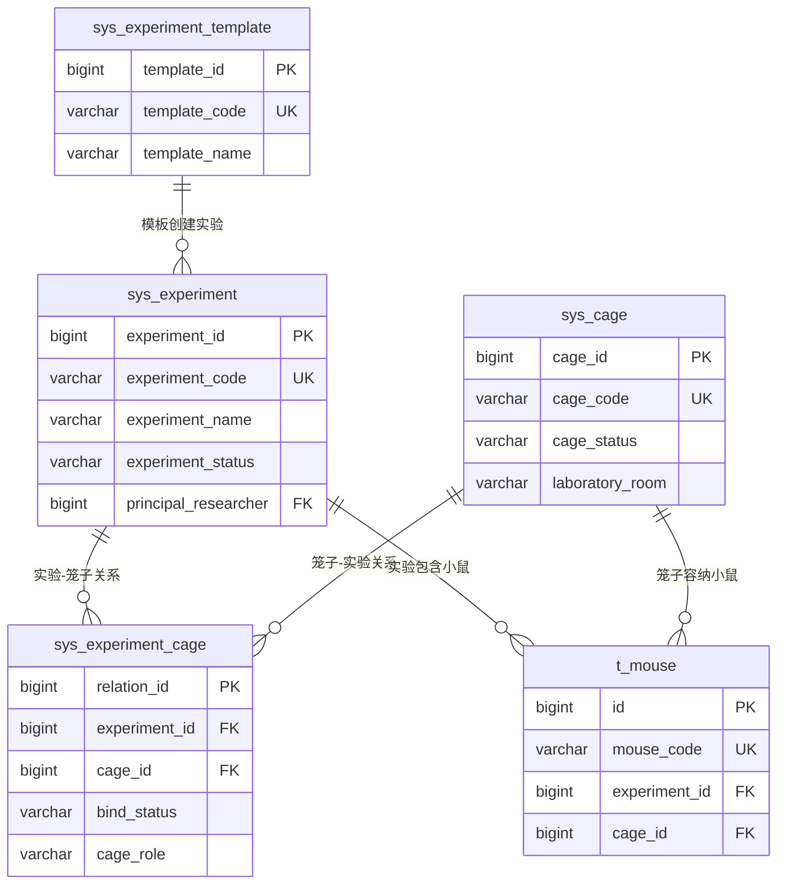
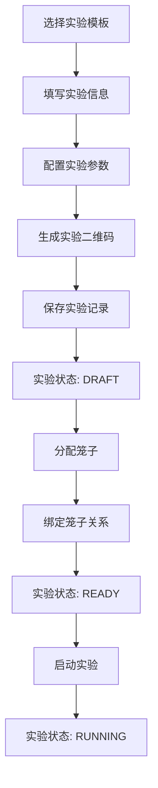
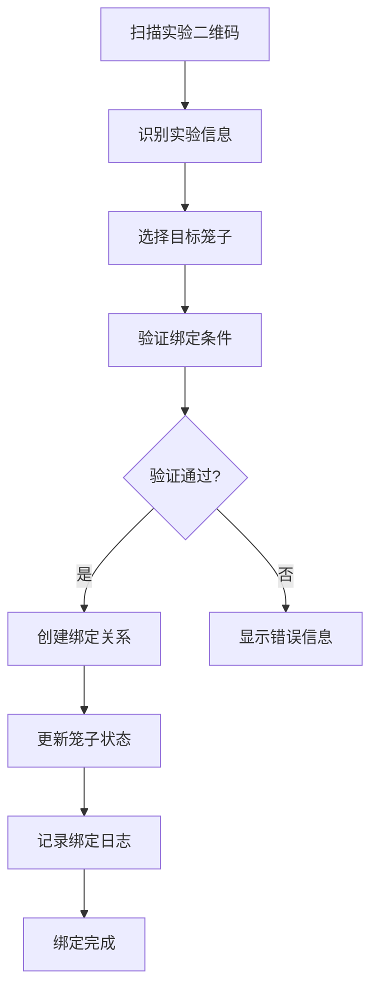

# 实验管理系统数据库设计文档

## 项目概述

### 系统定位
本文档描述了计算机视觉小鼠管理系统中**实验管理模块**的完整数据库设计方案。该模块采用"实验驱动"的架构设计，以实验为核心，通过二维码技术实现笼子与实验的智能绑定。

### 设计原则
- **实验驱动**: 以实验项目为起点的数据流设计
- **智能绑定**: 通过二维码实现设备与实验的自动关联
- **状态管理**: 完整的实验生命周期状态跟踪
- **数据安全**: 避免SQL注入风险，使用安全的字段命名
- **扩展性**: 支持未来功能扩展的灵活架构

## 核心表结构设计

### 1. 实验主表 (sys_experiment)

**表名**: `sys_experiment`  
**描述**: 实验管理的核心表，存储实验的基本信息、状态、时间规划等

#### 核心字段设计

```sql
-- 基础信息
experiment_id         BIGINT(20)      -- 实验ID (主键)
experiment_code       VARCHAR(50)     -- 实验编号 (唯一)
experiment_name       VARCHAR(100)    -- 实验名称
experiment_type       VARCHAR(50)     -- 实验类型
experiment_template   VARCHAR(100)    -- 实验模板名称

-- 实验状态管理 (详细的状态枚举)
experiment_status     VARCHAR(20)     -- 实验状态
-- 状态值: DRAFT(草稿) | READY(准备中) | RUNNING(进行中) | 
--        PAUSED(暂停) | COMPLETED(已完成) | CANCELLED(已取消) | ARCHIVED(已归档)

-- 时间管理
planned_begin_time    DATETIME        -- 计划开始时间
planned_finish_time   DATETIME        -- 计划结束时间
actual_begin_time     DATETIME        -- 实际开始时间
actual_finish_time    DATETIME        -- 实际结束时间
experiment_duration   INT             -- 实验周期(天)

-- 人员管理
principal_researcher  BIGINT(20)      -- 主要研究员ID
co_researchers        TEXT            -- 协作研究员ID列表(JSON格式)
experiment_team       VARCHAR(100)    -- 实验团队名称

-- 二维码管理
qr_code_content       TEXT            -- 实验二维码内容
qr_code_image_url     VARCHAR(500)    -- 二维码图片URL
```

#### 特色功能
1. **详细状态管理**: 7种实验状态，覆盖完整生命周期
2. **时间规划**: 支持计划时间与实际时间的对比分析
3. **团队协作**: 支持主研究员+协作研究员的团队模式
4. **二维码集成**: 每个实验自动生成专属二维码

### 2. 实验模板表 (sys_experiment_template)

**表名**: `sys_experiment_template`  
**描述**: 实验模板管理，提供标准化的实验配置方案

#### 核心特性
- **标准化配置**: 预定义实验参数和设备需求
- **快速创建**: 基于模板快速创建新实验
- **版本管理**: 支持模板的启用/禁用状态管理

```sql
-- 模板配置示例
default_config       TEXT            -- 默认配置参数(JSON格式)
-- 示例: {"monitoring_duration":"24h","sampling_rate":"1fps","behaviors":["sleeping","eating"]}

required_equipment   TEXT            -- 必需设备列表(JSON格式)
-- 示例: ["camera","sensor","dispenser"]
```

### 3. 笼子管理表 (sys_cage)

**表名**: `sys_cage`  
**描述**: 笼子的完整信息管理，包括位置、规格、状态等

#### 位置管理系统
```sql
laboratory_room      VARCHAR(50)     -- 实验室房间
rack_number          VARCHAR(20)     -- 货架编号
position_row         INT             -- 行位置
position_column      INT             -- 列位置
```

#### 状态管理
```sql
cage_status          VARCHAR(20)     -- 笼子状态
-- 状态值: AVAILABLE(可用) | OCCUPIED(占用中) | MAINTENANCE(维护中) | 
--        DAMAGED(损坏) | RETIRED(退役)
```

#### 容量管理
```sql
max_capacity         INT             -- 最大容量(只)
current_count        INT             -- 当前小鼠数量
```

### 4. 实验笼子关系表 (sys_experiment_cage)

**表名**: `sys_experiment_cage`  
**描述**: 实验与笼子的多对多关系管理，支持动态绑定

#### 绑定管理
```sql
bind_time            DATETIME        -- 绑定时间
unbind_time          DATETIME        -- 解绑时间
bind_status          VARCHAR(20)     -- 绑定状态
-- 状态值: ACTIVE(激活) | INACTIVE(未激活) | UNBOUND(已解绑)

bind_method          VARCHAR(20)     -- 绑定方式
-- 方式: MANUAL(手动绑定) | QR_SCAN(二维码扫描) | AUTO(自动绑定)
```

#### 实验角色
```sql
cage_role            VARCHAR(50)     -- 笼子角色
-- 角色: EXPERIMENTAL(实验组) | CONTROL(对照组) | BACKUP(备用组)
```

### 5. 实验进度记录表 (sys_experiment_progress)

**表名**: `sys_experiment_progress`  
**描述**: 实验进度的详细跟踪记录

#### 进度跟踪
```sql
progress_stage       VARCHAR(50)     -- 进度阶段
completion_rate      DECIMAL(5,2)    -- 完成率(%)
data_collected       INT             -- 已收集数据量
mice_monitored       INT             -- 监控小鼠数量
```

### 6. 实验文件管理表 (sys_experiment_file)

**表名**: `sys_experiment_file`  
**描述**: 实验相关文件的统一管理，集成MinIO存储

#### MinIO集成
```sql
bucket_name          VARCHAR(100)    -- MinIO存储桶名称
object_name          VARCHAR(500)    -- MinIO对象名称
file_category        VARCHAR(50)     -- 文件分类
-- 分类: PROTOCOL(实验方案) | RESULT(实验结果) | REPORT(实验报告) | 
--      QR_CODE(二维码) | OTHER(其他)
```

## 数据关系设计

### 核心关系图



### 关系说明

1. **实验 ↔ 笼子**: 多对多关系，通过关系表管理
2. **实验 → 小鼠**: 一对多关系，小鼠属于特定实验
3. **笼子 → 小鼠**: 一对多关系，小鼠居住在特定笼子
4. **模板 → 实验**: 一对多关系，模板可创建多个实验

## 业务流程设计

### 实验创建流程



### 笼子绑定流程



## 安全设计

### SQL注入防护

根据系统安全要求，避免使用可能导致SQL注入的关键词：

```java
// 系统过滤的关键词
String SQL_REGEX = "\u000B|and |extractvalue|updatexml|sleep|exec |insert |select |delete |update |drop |count |chr |mid |master |truncate |char |declare |or |union |like |+|/*|user()";
```

### 字段命名策略

- 使用 `build_time` 替代 `create_time`
- 使用 `modify_time` 替代 `update_time`
- 使用 `build_by` 替代 `create_by`
- 使用 `modify_by` 替代 `update_by`

## 性能优化

### 索引设计

```sql
-- 核心业务索引
CREATE INDEX idx_experiment_status ON sys_experiment(experiment_status);
CREATE INDEX idx_cage_status ON sys_cage(cage_status);
CREATE INDEX idx_experiment_cage_bind_time ON sys_experiment_cage(bind_time);

-- 查询优化索引
CREATE INDEX idx_planned_begin_time ON sys_experiment(planned_begin_time);
CREATE INDEX idx_laboratory_room ON sys_cage(laboratory_room);
```

### 查询优化视图

```sql
-- 实验概览视图
CREATE VIEW v_experiment_overview AS
SELECT 
    e.experiment_id,
    e.experiment_code,
    e.experiment_name,
    e.experiment_status,
    u.user_name as principal_researcher_name,
    COUNT(DISTINCT ec.cage_id) as total_cages,
    COUNT(DISTINCT m.id) as total_mice
FROM sys_experiment e
LEFT JOIN sys_user u ON e.principal_researcher = u.user_id
LEFT JOIN sys_experiment_cage ec ON e.experiment_id = ec.experiment_id
LEFT JOIN t_mouse m ON e.experiment_id = m.experiment_id
WHERE e.del_flag = '0'
GROUP BY e.experiment_id;
```

## 数据初始化

### 实验模板数据

```sql
-- 标准行为监测实验模板
INSERT INTO sys_experiment_template VALUES
(1, 'TPL001', '标准行为监测实验', 'BEHAVIOR', 
 '用于监测小鼠日常行为模式的标准实验模板', 7, 
 '{"monitoring_duration":"24h","sampling_rate":"1fps"}', 
 '["camera","sensor"]', '0', 'admin', NOW());

-- 药物效应评估实验模板
INSERT INTO sys_experiment_template VALUES
(2, 'TPL002', '药物效应评估实验', 'DRUG_TEST', 
 '用于评估药物对小鼠行为影响的实验模板', 14, 
 '{"monitoring_duration":"24h","drug_administration":true}', 
 '["camera","sensor","dispenser"]', '0', 'admin', NOW());
```

### 笼子数据

```sql
-- 标准实验笼子
INSERT INTO sys_cage VALUES
(1, 'CAGE001', '实验室A-1号笼子', 'STANDARD', 
 '实验室A', 'RACK01', 1, 1, 5, 0, 'AVAILABLE', 
 '20-25', '40-70', '{"cage_id":"CAGE001"}', NULL, 
 'admin', NOW());
```

## 前端菜单配置

### 菜单结构

```
🧪 实验管理
├── 📋 实验列表管理
├── ➕ 创建实验
├── 📝 实验模板管理
├── 🔍 实验详情
├── 📱 实验二维码管理
└── 📺 实验监控大屏

🏠 笼子管理
├── 📦 笼子列表管理
├── ➕ 添加笼子
├── 🔗 笼子绑定管理
├── 📱 二维码扫描中心
└── 📊 笼子状态监控
```

### 权限设计

- **实验管理权限**: `system:experiment:*`
- **笼子管理权限**: `system:cage:*`
- **二维码管理权限**: `system:experiment:qrcode:*`
- **监控权限**: `system:experiment:monitor`

## 技术实现建议

### 后端开发

1. **实体类设计**: 使用MyBatis-Plus的BaseEntity
2. **服务层**: 实现实验生命周期管理
3. **控制器**: RESTful API设计
4. **二维码生成**: 集成QR Code生成库

### 前端开发

1. **Vue3 + Element Plus**: 现代化UI框架
2. **二维码扫描**: 集成摄像头扫描功能
3. **实时监控**: WebSocket实时数据推送
4. **图表展示**: ECharts数据可视化

### 集成方案

1. **MinIO集成**: 文件存储和二维码图片管理
2. **Redis缓存**: 实验状态和实时数据缓存
3. **定时任务**: 实验进度自动更新
4. **消息队列**: 异步处理实验数据

## 扩展规划

### 短期扩展

1. **实验报告生成**: 自动生成实验分析报告
2. **数据导出**: Excel/PDF格式数据导出
3. **消息通知**: 实验状态变更通知
4. **移动端支持**: 移动设备二维码扫描

### 长期规划

1. **AI分析集成**: 智能行为分析结果集成
2. **多实验室支持**: 跨实验室实验管理
3. **API开放**: 第三方系统集成接口
4. **数据挖掘**: 实验数据深度分析

## 总结

本数据库设计方案为实验管理系统提供了：

✅ **完整的实验生命周期管理**  
✅ **灵活的笼子绑定机制**  
✅ **安全的数据存储设计**  
✅ **高性能的查询优化**  
✅ **可扩展的架构设计**  
✅ **标准化的权限管理**  

该设计方案充分考虑了实验驱动的业务特点，通过二维码技术实现了智能化的设备绑定，为后续的前端开发和系统集成奠定了坚实的数据基础。