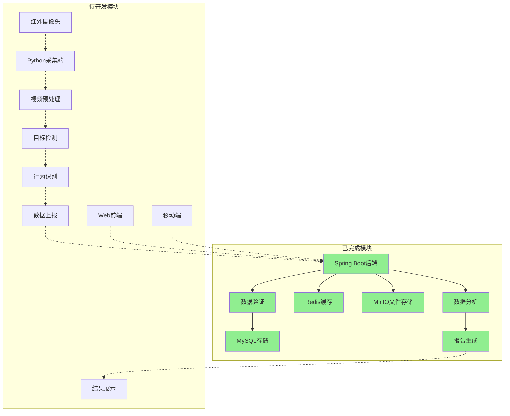

# 小鼠行为监测系统 - 系统设计文档

## 1. 系统架构概览

### 1.1 当前实现状态

**已完成模块：**
- ✅ 后端服务框架 (Spring Boot + 若依框架)
- ✅ 数据库设计 (MySQL)
- ✅ 缓存系统 (Redis)
- ✅ 文件存储 (MinIO)
- ✅ Docker容器化部署
- ✅ 自动化部署脚本
- ✅ RESTful API接口规范

**开发中模块：**
- 🔄 前端界面优化
- 🔄 Excel导出功能
- 🔄 系统性能优化

**待开发模块：**
- ⏳ Python数据采集端
- ⏳ 行为识别算法
- ⏳ 前端Vue.js应用
- ⏳ 移动端应用

### 1.2 整体架构图

```
┌─────────────────────────────────────────────────────────────────┐
│                    小鼠行为监测系统 v1.0                        │
├─────────────────────────────────────────────────────────────────┤
│  前端展示层 (Presentation Layer) - 待开发                       │
│  ┌─────────────────┐    ┌─────────────────┐                    │
│  │   Web管理端     │    │   移动端App     │                    │
│  │  (Vue3+Element) │    │   (uni-app)     │                    │
│  └─────────────────┘    └─────────────────┘                    │
├─────────────────────────────────────────────────────────────────┤
│  业务服务层 (Business Service Layer) - 已完成                   │
│  ┌─────────────────────────────────────────────────────────────┐│
│  │              Spring Boot 后端服务                          ││
│  │  ┌─────────────┐ ┌─────────────┐ ┌─────────────┐          ││
│  │  │  用户管理   │ │  系统管理   │ │  数据管理   │          ││
│  │  │   模块     │ │    模块     │ │    模块     │          ││
│  │  └─────────────┘ └─────────────┘ └─────────────┘          ││
│  └─────────────────────────────────────────────────────────────┘│
├─────────────────────────────────────────────────────────────────┤
│  数据采集层 (Data Collection Layer) - 待开发                   │
│  ┌─────────────────────────────────────────────────────────────┐│
│  │              Python数据采集端                               ││
│  │  ┌─────────────┐ ┌─────────────┐ ┌─────────────┐          ││
│  │  │  视频采集   │ │  行为识别   │ │  数据上报   │          ││
│  │  │   模块     │ │    模块     │ │    模块     │          ││
│  │  └─────────────┘ └─────────────┘ └─────────────┘          ││
│  └─────────────────────────────────────────────────────────────┘│
├─────────────────────────────────────────────────────────────────┤
│  数据存储层 (Data Storage Layer) - 已完成                       │
│  ┌─────────────┐ ┌─────────────┐ ┌─────────────┐              │
│  │   MySQL     │ │    Redis    │ │   MinIO     │              │
│  │  (结构化)   │ │   (缓存)    │ │  (文件)     │              │
│  └─────────────┘ └─────────────┘ └─────────────┘              │
├─────────────────────────────────────────────────────────────────┤
│  基础设施层 (Infrastructure Layer) - 已完成                     │
│  ┌─────────────────────────────────────────────────────────────┐│
│  │        Docker容器化 + 自动化部署脚本                        ││
│  └─────────────────────────────────────────────────────────────┘│
└─────────────────────────────────────────────────────────────────┘
```

### 1.2 数据流向图



## 2. 核心模块设计

### 2.1 后端服务 (Spring Boot) - 已完成

#### 2.1.1 系统管理模块

**用户管理：**
- 用户注册、登录、权限管理
- 角色分配和权限控制
- 用户信息维护

**系统配置：**
- 系统参数配置
- 字典数据管理
- 菜单权限管理

**日志管理：**
- 操作日志记录
- 登录日志追踪
- 系统异常日志

#### 2.1.2 数据管理模块

**数据存储：**
- MySQL关系型数据存储
- Redis缓存数据管理
- MinIO文件存储服务

**数据导出：**
- Excel数据导出功能
- 自定义导出模板
- 批量数据处理

**API接口：**
- RESTful API设计
- 统一响应格式
- 接口文档自动生成

### 2.2 数据采集端 (Python) - 待开发

#### 2.2.1 视频采集模块 (VideoCapture)
```python
class VideoCapture:
    """
    视频采集模块
    负责从红外摄像头获取视频流
    """
    def __init__(self, camera_id, resolution=(1920, 1080))
    def start_capture()
    def get_frame()
    def stop_capture()
    def set_night_vision_mode()
```

#### 2.1.2 目标检测模块 (MouseDetector)
```python
class MouseDetector:
    """
    小鼠检测模块
    基于YOLO进行小鼠目标检测
    """
    def __init__(self, model_path, confidence_threshold=0.5)
    def detect_mice(self, frame)
    def load_custom_model(self, model_path)
    def update_model(self, new_model_path)
```

#### 2.1.3 多目标追踪模块 (MouseTracker)
```python
class MouseTracker:
    """
    多目标追踪模块
    基于DeepSORT进行小鼠追踪
    """
    def __init__(self, max_mice=5)
    def update_tracks(self, detections)
    def get_mouse_trajectories()
    def handle_occlusion()
```

#### 2.1.4 行为识别模块 (BehaviorRecognizer)
```python
class BehaviorRecognizer:
    """
    行为识别模块
    识别睡眠、咳嗽、挠鼻等特定行为
    """
    def __init__(self)
    def recognize_sleep(self, mouse_data)
    def recognize_cough(self, mouse_data)
    def recognize_nose_scratching(self, mouse_data)
    def recognize_defecation(self, mouse_data)
    def recognize_convulsion(self, mouse_data)
```

#### 2.1.5 数据上报模块 (DataReporter)
```python
class DataReporter:
    """
    数据上报模块
    将识别结果上报到后端服务
    """
    def __init__(self, api_endpoint, api_key)
    def report_behavior_data(self, behavior_data)
    def report_heartbeat()
    def handle_network_error()
```

### 2.4 后端服务 (Spring Boot) - 已完成

#### 2.2.1 系统管理接口
```java
@RestController
@RequestMapping("/system")
public class SystemController {
    // 用户管理
    @GetMapping("/user/list")
    public TableDataInfo list(SysUser user)
    
    @PostMapping("/user")
    public AjaxResult add(@RequestBody SysUser user)
    
    @PutMapping("/user")
    public AjaxResult edit(@RequestBody SysUser user)
    
    @DeleteMapping("/user/{userIds}")
    public AjaxResult remove(@PathVariable Long[] userIds)
}
```

#### 2.2.2 数据导出接口
```java
@RestController
@RequestMapping("/export")
public class ExportController {
    // Excel导出
    @PostMapping("/excel")
    public void export(HttpServletResponse response, @RequestBody ExportRequest request)
    
    // 数据查询
    @GetMapping("/data")
    public TableDataInfo getData(@RequestParam Map<String, Object> params)
    
    // 模板下载
    @GetMapping("/template/{templateName}")
    public void downloadTemplate(@PathVariable String templateName, HttpServletResponse response)
}
```

#### 2.2.3 文件管理服务
```java
@Service
public class FileService {
    // MinIO文件上传
    public String uploadFile(MultipartFile file, String bucketName)
    
    // 文件下载
    public InputStream downloadFile(String fileName, String bucketName)
    
    // 文件删除
    public boolean deleteFile(String fileName, String bucketName)
    
    // 获取文件访问URL
    public String getFileUrl(String fileName, String bucketName)
}
```

#### 2.2.4 待开发接口（预留）
```java
// 设备管理接口（待开发）
@RestController
@RequestMapping("/api/devices")
public class DeviceController {
    // 设备注册
    @PostMapping("/register")
    public Result registerDevice(@RequestBody DeviceRegisterDTO dto)
    
    // 设备状态更新
    @PutMapping("/{deviceId}/status")
    public Result updateDeviceStatus(@PathVariable String deviceId, @RequestBody DeviceStatusDTO dto)
    
    // 获取设备列表
    @GetMapping
    public Result<List<DeviceVO>> getDeviceList()
}

// 数据接收接口（待开发）
@RestController
@RequestMapping("/api/data")
public class DataController {
    // 接收行为数据
    @PostMapping("/behavior")
    public Result receiveBehaviorData(@RequestBody BehaviorDataDTO dto)
    
    // 批量接收数据
    @PostMapping("/behavior/batch")
    public Result receiveBehaviorDataBatch(@RequestBody List<BehaviorDataDTO> dtoList)
    
    // 接收心跳数据
    @PostMapping("/heartbeat")
    public Result receiveHeartbeat(@RequestBody HeartbeatDTO dto)
}
```

### 2.3 前端模块 (Vue 3) - 待开发

#### 2.3.1 技术选型

**前端框架：**
- Vue 3 - 主框架
- Element Plus - UI组件库
- Vue Router - 路由管理
- Pinia - 状态管理
- Axios - HTTP客户端

**开发工具：**
- Vite - 构建工具
- TypeScript - 类型支持
- ESLint - 代码检查
- Prettier - 代码格式化

#### 2.3.2 页面结构设计

**主要页面：**
- 登录页面 - 用户身份认证
- 首页仪表板 - 系统概览
- 用户管理 - 用户信息维护
- 角色管理 - 权限角色配置
- 菜单管理 - 系统菜单配置
- 数据导出 - Excel导出功能
- 系统监控 - 系统状态监控
- 操作日志 - 用户操作记录

**待开发页面：**
- 设备管理 - 监控设备管理
- 实时监控 - 视频流监控
- 数据分析 - 行为数据分析
- 报告生成 - 分析报告生成

#### 2.3.3 组件设计

**基础组件：**
```vue
<!-- 数据表格组件 -->
<template>
  <div class="table-container">
    <el-table :data="tableData" v-loading="loading">
      <el-table-column v-for="column in columns" :key="column.prop" v-bind="column" />
    </el-table>
    <pagination v-if="showPagination" :total="total" @pagination="handlePagination" />
  </div>
</template>

<!-- 表单组件 -->
<template>
  <el-form :model="form" :rules="rules" ref="formRef">
    <el-form-item v-for="field in fields" :key="field.prop" v-bind="field">
      <component :is="field.component" v-model="form[field.prop]" v-bind="field.props" />
    </el-form-item>
  </el-form>
</template>

<!-- 文件上传组件 -->
<template>
  <el-upload
    :action="uploadUrl"
    :headers="headers"
    :on-success="handleSuccess"
    :on-error="handleError"
  >
    <el-button type="primary">点击上传</el-button>
  </el-upload>
</template>
```

## 3. 关键接口定义

### 3.1 当前已实现接口

#### 3.1.1 用户管理接口

**用户登录：** `POST /login`
```json
// 请求参数
{
  "username": "admin",
  "password": "admin123",
  "code": "1234",
  "uuid": "uuid-string"
}

// 响应格式
{
  "code": 200,
  "msg": "操作成功",
  "token": "eyJhbGciOiJIUzUxMiJ9..."
}
```

**获取用户信息：** `GET /getInfo`
```json
// 响应格式
{
  "code": 200,
  "msg": "操作成功",
  "data": {
    "user": {
      "userId": 1,
      "userName": "admin",
      "nickName": "管理员"
    },
    "roles": ["admin"],
    "permissions": ["*:*:*"]
  }
}
```

#### 3.1.2 系统管理接口

**获取用户列表：** `GET /system/user/list`
```json
// 响应格式
{
  "code": 200,
  "msg": "查询成功",
  "rows": [
    {
      "userId": 1,
      "userName": "admin",
      "nickName": "管理员",
      "email": "admin@example.com",
      "status": "0",
      "createTime": "2024-01-15 10:30:00"
    }
  ],
  "total": 1
}
```

**数据导出接口：** `POST /export/excel`
```json
// 请求参数
{
  "tableName": "sys_user",
  "columns": ["userName", "nickName", "email"],
  "conditions": {
    "status": "0"
  }
}

// 响应：Excel文件流
```

### 3.2 待开发接口（预留设计）

#### 3.2.1 设备管理接口

**设备注册：** `POST /api/device/register`
```json
{
  "deviceId": "device_001",
  "deviceName": "监控设备1",
  "location": "实验室A",
  "deviceType": "camera"
}
```

**设备心跳：** `POST /api/device/heartbeat`
```json
{
  "deviceId": "device_001",
  "timestamp": "2024-01-15T10:30:00Z",
  "status": "online",
  "systemInfo": {
    "cpuUsage": 45.2,
    "memoryUsage": 67.8
  }
}
```

#### 3.2.2 数据采集接口

**行为数据上报：** `POST /api/data/behavior`
```json
{
  "deviceId": "device_001",
  "timestamp": "2024-01-15T10:30:00Z",
  "cageId": "cage_001",
  "mouseData": [
    {
      "mouseId": "mouse_001",
      "position": {
        "x": 150.5,
        "y": 200.3
      },
      "behaviors": [
        {
          "type": "COUGH",
          "confidence": 0.85,
          "duration": 2.5,
          "startTime": "2024-01-15T10:30:00Z",
          "endTime": "2024-01-15T10:30:02.5Z"
        }
      ]
    }
  ],
  "environmentData": {
    "temperature": 22.5,
    "humidity": 60.2,
    "lightLevel": 0.1
  }
}
```

### 3.2 数据查询API

#### 3.2.1 行为统计查询
```json
GET /api/analysis/behavior-statistics
Authorization: Bearer {token}

Query Parameters:
- deviceId: string (required)
- startTime: datetime (required)
- endTime: datetime (required)
- behaviorTypes: array[string] (optional)
- mouseIds: array[string] (optional)

Response:
{
  "code": 200,
  "message": "success",
  "data": {
    "totalCount": 150,
    "behaviorCounts": {
      "COUGH": 45,
      "NOSE_SCRATCH": 32,
      "SLEEP": 73
    },
    "mouseStatistics": [
      {
        "mouseId": "mouse_001",
        "behaviorCounts": {
          "COUGH": 12,
          "NOSE_SCRATCH": 8,
          "SLEEP": 15
        }
      }
    ],
    "timeDistribution": [
      {
        "hour": 0,
        "count": 8
      }
    ]
  }
}
```

### 3.3 WebSocket实时推送

#### 3.3.1 实时行为推送
```json
// WebSocket连接: ws://localhost:8080/ws/realtime
// 消息格式:
{
  "type": "BEHAVIOR_DETECTED",
  "data": {
    "deviceId": "device_001",
    "mouseId": "mouse_001",
    "behavior": {
      "type": "COUGH",
      "confidence": 0.85,
      "timestamp": "2024-01-15T10:30:00Z"
    }
  }
}
```

## 4. 数据库设计

### 4.1 核心表结构

#### 4.1.1 设备表 (t_device)
```sql
CREATE TABLE t_device (
    id BIGINT PRIMARY KEY AUTO_INCREMENT,
    device_id VARCHAR(50) UNIQUE NOT NULL COMMENT '设备ID',
    device_name VARCHAR(100) NOT NULL COMMENT '设备名称',
    device_type VARCHAR(50) DEFAULT 'CAMERA' COMMENT '设备类型',
    location VARCHAR(200) COMMENT '设备位置',
    ip_address VARCHAR(45) COMMENT 'IP地址',
    port INT COMMENT '端口号',
    status VARCHAR(20) DEFAULT 'OFFLINE' COMMENT '设备状态:ONLINE,OFFLINE,ERROR,MAINTENANCE',
    last_heartbeat DATETIME COMMENT '最后心跳时间',
    hardware_info JSON COMMENT '硬件信息',
    config_info JSON COMMENT '配置信息',
    created_by BIGINT COMMENT '创建人ID',
    created_time DATETIME DEFAULT CURRENT_TIMESTAMP,
    updated_time DATETIME DEFAULT CURRENT_TIMESTAMP ON UPDATE CURRENT_TIMESTAMP,
    is_deleted TINYINT DEFAULT 0 COMMENT '是否删除:0-否,1-是',
    INDEX idx_device_id (device_id),
    INDEX idx_status (status),
    INDEX idx_created_time (created_time)
);
```

#### 4.1.2 鼠笼表 (t_cage)
```sql
CREATE TABLE t_cage (
    id BIGINT PRIMARY KEY AUTO_INCREMENT,
    cage_id VARCHAR(50) UNIQUE NOT NULL COMMENT '鼠笼ID',
    device_id VARCHAR(50) NOT NULL COMMENT '关联设备ID',
    cage_name VARCHAR(100) NOT NULL COMMENT '鼠笼名称',
    cage_type VARCHAR(50) COMMENT '鼠笼类型',
    mouse_count INT DEFAULT 0 COMMENT '小鼠数量',
    max_mouse_count INT DEFAULT 5 COMMENT '最大小鼠数量',
    experiment_group VARCHAR(100) COMMENT '实验组别',
    experiment_id VARCHAR(100) COMMENT '实验ID',
    environment_info JSON COMMENT '环境信息(温度、湿度等)',
    cage_size JSON COMMENT '鼠笼尺寸信息',
    status VARCHAR(20) DEFAULT 'ACTIVE' COMMENT '状态:ACTIVE,INACTIVE,MAINTENANCE',
    created_by BIGINT COMMENT '创建人ID',
    created_time DATETIME DEFAULT CURRENT_TIMESTAMP,
    updated_time DATETIME DEFAULT CURRENT_TIMESTAMP ON UPDATE CURRENT_TIMESTAMP,
    is_deleted TINYINT DEFAULT 0 COMMENT '是否删除:0-否,1-是',
    INDEX idx_cage_id (cage_id),
    INDEX idx_device_id (device_id),
    INDEX idx_experiment_group (experiment_group),
    INDEX idx_status (status)
);
```

#### 4.1.3 小鼠表 (t_mouse)
```sql
CREATE TABLE t_mouse (
    id BIGINT PRIMARY KEY AUTO_INCREMENT,
    mouse_id VARCHAR(50) UNIQUE NOT NULL COMMENT '小鼠ID',
    cage_id VARCHAR(50) NOT NULL COMMENT '所属鼠笼ID',
    mouse_name VARCHAR(100) COMMENT '小鼠名称',
    mouse_code VARCHAR(50) COMMENT '小鼠编号',
    gender VARCHAR(10) COMMENT '性别:MALE,FEMALE,UNKNOWN',
    age_weeks INT COMMENT '周龄',
    weight_grams DECIMAL(6,2) COMMENT '体重(克)',
    strain VARCHAR(50) COMMENT '品系',
    source VARCHAR(100) COMMENT '来源',
    birth_date DATE COMMENT '出生日期',
    entry_date DATE COMMENT '入笼日期',
    health_status VARCHAR(20) DEFAULT 'HEALTHY' COMMENT '健康状态:HEALTHY,SICK,DEAD',
    tracking_color VARCHAR(20) COMMENT '追踪标识颜色',
    notes TEXT COMMENT '备注信息',
    created_by BIGINT COMMENT '创建人ID',
    created_time DATETIME DEFAULT CURRENT_TIMESTAMP,
    updated_time DATETIME DEFAULT CURRENT_TIMESTAMP ON UPDATE CURRENT_TIMESTAMP,
    is_deleted TINYINT DEFAULT 0 COMMENT '是否删除:0-否,1-是',
    INDEX idx_mouse_id (mouse_id),
    INDEX idx_cage_id (cage_id),
    INDEX idx_health_status (health_status),
    INDEX idx_strain (strain)
);
```

#### 4.1.4 行为数据表 (t_behavior_data)
```sql
CREATE TABLE t_behavior_data (
    id BIGINT PRIMARY KEY AUTO_INCREMENT,
    device_id VARCHAR(50) NOT NULL COMMENT '设备ID',
    cage_id VARCHAR(50) NOT NULL COMMENT '鼠笼ID',
    mouse_id VARCHAR(50) NOT NULL COMMENT '小鼠ID',
    behavior_type VARCHAR(50) NOT NULL COMMENT '行为类型:SLEEP,COUGH,NOSE_SCRATCH,DEFECATION,CONVULSION,MOVEMENT,EATING,DRINKING',
    behavior_subtype VARCHAR(50) COMMENT '行为子类型',
    confidence DECIMAL(5,4) NOT NULL COMMENT '置信度(0-1)',
    duration_seconds DECIMAL(10,3) COMMENT '持续时间(秒)',
    position_x DECIMAL(10,3) COMMENT 'X坐标',
    position_y DECIMAL(10,3) COMMENT 'Y坐标',
    bounding_box JSON COMMENT '边界框信息',
    start_time DATETIME NOT NULL COMMENT '开始时间',
    end_time DATETIME COMMENT '结束时间',
    frame_start INT COMMENT '开始帧号',
    frame_end INT COMMENT '结束帧号',
    video_file_path VARCHAR(500) COMMENT '视频文件路径',
    image_file_path VARCHAR(500) COMMENT '截图文件路径',
    additional_data JSON COMMENT '额外数据',
    is_verified TINYINT DEFAULT 0 COMMENT '是否已验证:0-否,1-是',
    verified_by BIGINT COMMENT '验证人ID',
    verified_time DATETIME COMMENT '验证时间',
    created_time DATETIME DEFAULT CURRENT_TIMESTAMP,
    INDEX idx_device_time (device_id, start_time),
    INDEX idx_cage_time (cage_id, start_time),
    INDEX idx_mouse_behavior (mouse_id, behavior_type),
    INDEX idx_time_range (start_time, end_time),
    INDEX idx_behavior_type (behavior_type),
    INDEX idx_confidence (confidence),
    INDEX idx_verified (is_verified)
);
```

#### 4.1.5 实验项目表 (t_experiment)
```sql
CREATE TABLE t_experiment (
    id BIGINT PRIMARY KEY AUTO_INCREMENT,
    experiment_id VARCHAR(50) UNIQUE NOT NULL COMMENT '实验ID',
    experiment_name VARCHAR(200) NOT NULL COMMENT '实验名称',
    experiment_type VARCHAR(50) COMMENT '实验类型',
    description TEXT COMMENT '实验描述',
    principal_investigator VARCHAR(100) COMMENT '主要研究者',
    start_date DATE COMMENT '开始日期',
    end_date DATE COMMENT '结束日期',
    status VARCHAR(20) DEFAULT 'PLANNING' COMMENT '状态:PLANNING,RUNNING,PAUSED,COMPLETED,CANCELLED',
    protocol_file_path VARCHAR(500) COMMENT '实验方案文件路径',
    approval_number VARCHAR(100) COMMENT '伦理审批号',
    funding_source VARCHAR(200) COMMENT '资助来源',
    created_by BIGINT COMMENT '创建人ID',
    created_time DATETIME DEFAULT CURRENT_TIMESTAMP,
    updated_time DATETIME DEFAULT CURRENT_TIMESTAMP ON UPDATE CURRENT_TIMESTAMP,
    is_deleted TINYINT DEFAULT 0 COMMENT '是否删除:0-否,1-是',
    INDEX idx_experiment_id (experiment_id),
    INDEX idx_status (status),
    INDEX idx_date_range (start_date, end_date)
);
```

#### 4.1.6 用户表 (t_user)
```sql
CREATE TABLE t_user (
    id BIGINT PRIMARY KEY AUTO_INCREMENT,
    username VARCHAR(50) UNIQUE NOT NULL COMMENT '用户名',
    password VARCHAR(255) NOT NULL COMMENT '密码(加密)',
    real_name VARCHAR(100) COMMENT '真实姓名',
    email VARCHAR(100) COMMENT '邮箱',
    phone VARCHAR(20) COMMENT '电话',
    department VARCHAR(100) COMMENT '部门',
    role VARCHAR(50) DEFAULT 'USER' COMMENT '角色:ADMIN,RESEARCHER,OPERATOR,VIEWER',
    status VARCHAR(20) DEFAULT 'ACTIVE' COMMENT '状态:ACTIVE,INACTIVE,LOCKED',
    last_login_time DATETIME COMMENT '最后登录时间',
    last_login_ip VARCHAR(45) COMMENT '最后登录IP',
    created_by BIGINT COMMENT '创建人ID',
    created_time DATETIME DEFAULT CURRENT_TIMESTAMP,
    updated_time DATETIME DEFAULT CURRENT_TIMESTAMP ON UPDATE CURRENT_TIMESTAMP,
    is_deleted TINYINT DEFAULT 0 COMMENT '是否删除:0-否,1-是',
    INDEX idx_username (username),
    INDEX idx_email (email),
    INDEX idx_role (role),
    INDEX idx_status (status)
);
```

#### 4.1.7 标注任务表 (t_annotation_task)
```sql
CREATE TABLE t_annotation_task (
    id BIGINT PRIMARY KEY AUTO_INCREMENT,
    task_id VARCHAR(50) UNIQUE NOT NULL COMMENT '任务ID',
    task_name VARCHAR(200) NOT NULL COMMENT '任务名称',
    task_type VARCHAR(50) COMMENT '任务类型:VIDEO_ANNOTATION,BEHAVIOR_ANNOTATION,QUALITY_CHECK',
    description TEXT COMMENT '任务描述',
    video_file_path VARCHAR(500) COMMENT '视频文件路径',
    start_frame INT COMMENT '开始帧',
    end_frame INT COMMENT '结束帧',
    assigned_to BIGINT COMMENT '分配给用户ID',
    priority VARCHAR(20) DEFAULT 'NORMAL' COMMENT '优先级:HIGH,NORMAL,LOW',
    status VARCHAR(20) DEFAULT 'PENDING' COMMENT '状态:PENDING,IN_PROGRESS,COMPLETED,REJECTED',
    deadline DATETIME COMMENT '截止时间',
    completed_time DATETIME COMMENT '完成时间',
    quality_score DECIMAL(3,2) COMMENT '质量评分(0-10)',
    notes TEXT COMMENT '备注',
    created_by BIGINT COMMENT '创建人ID',
    created_time DATETIME DEFAULT CURRENT_TIMESTAMP,
    updated_time DATETIME DEFAULT CURRENT_TIMESTAMP ON UPDATE CURRENT_TIMESTAMP,
    INDEX idx_task_id (task_id),
    INDEX idx_assigned_to (assigned_to),
    INDEX idx_status (status),
    INDEX idx_deadline (deadline)
);
```

#### 4.1.8 标注结果表 (t_annotation_result)
```sql
CREATE TABLE t_annotation_result (
    id BIGINT PRIMARY KEY AUTO_INCREMENT,
    task_id VARCHAR(50) NOT NULL COMMENT '任务ID',
    mouse_id VARCHAR(50) COMMENT '小鼠ID',
    behavior_type VARCHAR(50) NOT NULL COMMENT '行为类型',
    start_frame INT NOT NULL COMMENT '开始帧',
    end_frame INT NOT NULL COMMENT '结束帧',
    start_time DATETIME NOT NULL COMMENT '开始时间',
    end_time DATETIME NOT NULL COMMENT '结束时间',
    position_data JSON COMMENT '位置数据',
    annotation_data JSON COMMENT '标注数据',
    annotator_id BIGINT NOT NULL COMMENT '标注员ID',
    annotation_time DATETIME DEFAULT CURRENT_TIMESTAMP COMMENT '标注时间',
    is_verified TINYINT DEFAULT 0 COMMENT '是否已验证',
    verified_by BIGINT COMMENT '验证人ID',
    verified_time DATETIME COMMENT '验证时间',
    INDEX idx_task_id (task_id),
    INDEX idx_mouse_id (mouse_id),
    INDEX idx_behavior_type (behavior_type),
    INDEX idx_annotator (annotator_id),
    INDEX idx_time_range (start_time, end_time)
);
```

#### 4.1.9 系统日志表 (t_system_log)
```sql
CREATE TABLE t_system_log (
    id BIGINT PRIMARY KEY AUTO_INCREMENT,
    log_type VARCHAR(50) NOT NULL COMMENT '日志类型:LOGIN,OPERATION,ERROR,SYSTEM',
    user_id BIGINT COMMENT '用户ID',
    module VARCHAR(100) COMMENT '模块名称',
    operation VARCHAR(200) COMMENT '操作描述',
    request_url VARCHAR(500) COMMENT '请求URL',
    request_method VARCHAR(10) COMMENT '请求方法',
    request_params TEXT COMMENT '请求参数',
    response_data TEXT COMMENT '响应数据',
    ip_address VARCHAR(45) COMMENT 'IP地址',
    user_agent TEXT COMMENT '用户代理',
    execution_time INT COMMENT '执行时间(毫秒)',
    status VARCHAR(20) COMMENT '状态:SUCCESS,FAILED,ERROR',
    error_message TEXT COMMENT '错误信息',
    created_time DATETIME DEFAULT CURRENT_TIMESTAMP,
    INDEX idx_log_type (log_type),
    INDEX idx_user_id (user_id),
    INDEX idx_created_time (created_time),
    INDEX idx_status (status)
);
```

#### 4.1.10 文件管理表 (t_file_info)
```sql
CREATE TABLE t_file_info (
    id BIGINT PRIMARY KEY AUTO_INCREMENT,
    file_id VARCHAR(50) UNIQUE NOT NULL COMMENT '文件ID',
    file_name VARCHAR(255) NOT NULL COMMENT '文件名',
    file_type VARCHAR(50) COMMENT '文件类型:VIDEO,IMAGE,DOCUMENT,DATA',
    file_size BIGINT COMMENT '文件大小(字节)',
    file_path VARCHAR(500) NOT NULL COMMENT '文件路径',
    file_url VARCHAR(500) COMMENT '文件访问URL',
    mime_type VARCHAR(100) COMMENT 'MIME类型',
    md5_hash VARCHAR(32) COMMENT 'MD5哈希值',
    related_id VARCHAR(50) COMMENT '关联ID(设备、鼠笼、小鼠等)',
    related_type VARCHAR(50) COMMENT '关联类型',
    upload_by BIGINT COMMENT '上传人ID',
    created_time DATETIME DEFAULT CURRENT_TIMESTAMP,
    is_deleted TINYINT DEFAULT 0 COMMENT '是否删除:0-否,1-是',
    INDEX idx_file_id (file_id),
    INDEX idx_file_type (file_type),
    INDEX idx_related (related_id, related_type),
    INDEX idx_upload_by (upload_by),
    INDEX idx_created_time (created_time)
);
```

## 5. 部署架构

### 5.1 Docker容器化部署

#### 5.1.1 生产环境Docker部署架构
```
┌─────────────────────────────────────────────────────────────────┐
│                    Docker Host (Linux/Windows)                  │
├─────────────────────────────────────────────────────────────────┤
│  ┌─────────────────────────────────────────────────────────────┐ │
│  │                Docker Compose 服务栈                        │ │
│  │  ┌─────────────┐  ┌─────────────┐  ┌─────────────┐        │ │
│  │  │   Nginx     │  │Spring Boot  │  │   MySQL     │        │ │
│  │  │  (前端)     │  │  (后端)     │  │  (数据库)   │        │ │
│  │  │  Port:80    │  │  Port:8080  │  │  Port:3306  │        │ │
│  │  └─────────────┘  └─────────────┘  └─────────────┘        │ │
│  │  ┌─────────────┐  ┌─────────────┐  ┌─────────────┐        │ │
│  │  │   Redis     │  │   MinIO     │  │  标注工具    │        │ │
│  │  │  (缓存)     │  │  (文件)     │  │  (CVAT)     │        │ │
│  │  │  Port:6379  │  │  Port:9000  │  │  Port:8081  │        │ │
│  │  └─────────────┘  └─────────────┘  └─────────────┘        │ │
│  └─────────────────────────────────────────────────────────────┘ │
├─────────────────────────────────────────────────────────────────┤
│  ┌─────────────────────────────────────────────────────────────┐ │
│  │                   数据卷挂载                                │ │
│  │  • /data/mysql     -> MySQL数据持久化                      │ │
│  │  • /data/redis     -> Redis数据持久化                      │ │
│  │  • /data/minio     -> MinIO文件存储                        │ │
│  │  • /data/videos    -> 视频文件存储                         │ │
│  │  • /data/logs      -> 应用日志存储                         │ │
│  │  • /data/config    -> 配置文件存储                         │ │
│  └─────────────────────────────────────────────────────────────┘ │
└─────────────────────────────────────────────────────────────────┘

外部采集端 (独立部署)
┌─────────────┐  ┌─────────────┐  ┌─────────────┐
│  采集端1    │  │  采集端2    │  │  采集端N    │
│             │  │             │  │             │
│  Python     │  │  Python     │  │  Python     │
│  Camera     │  │  Camera     │  │  Camera     │
│  GPU        │  │  GPU        │  │  GPU        │
└─────────────┘  └─────────────┘  └─────────────┘
       │                │                │
       └────────────────┼────────────────┘
                        │
                   HTTP/WebSocket
                        │
                ┌───────▼───────┐
                │  Docker Host  │
                │   (服务端)    │
                └───────────────┘
```

#### 5.1.2 开发环境部署选择

**方案一：完全Docker化开发环境（推荐）**

**优势：**
- 环境一致性：开发、测试、生产环境完全一致
- 快速启动：一键启动所有服务
- 依赖隔离：避免本地环境污染
- 团队协作：新成员快速上手
- 版本控制：Docker镜像版本化管理

**劣势：**
- 调试复杂度稍高
- 资源占用相对较大

**方案二：混合开发环境**
- MySQL、Redis在Docker中运行
- Spring Boot在IDE中直接运行
- 前端在本地开发服务器运行

**推荐使用方案一的理由：**
1. **避免环境配置地狱**：MySQL版本、Redis版本、Java版本等不一致导致的问题
2. **快速环境重建**：系统崩溃或更换开发机器时，几分钟内恢复开发环境
3. **生产环境一致性**：减少"在我机器上能跑"的问题
4. **CI/CD友好**：持续集成环境与开发环境一致
5. **团队协作效率**：新成员只需要Docker即可开始开发

### 5.2 Docker Compose配置示例

```yaml
# docker-compose.yml
version: '3.8'

services:
  # MySQL数据库
  mysql:
    image: mysql:8.0
    container_name: mouse-mysql
    environment:
      MYSQL_ROOT_PASSWORD: root123
      MYSQL_DATABASE: mouse_monitor
      MYSQL_USER: mouse_user
      MYSQL_PASSWORD: mouse_pass
    ports:
      - "3306:3306"
    volumes:
      - mysql_data:/var/lib/mysql
      - ./sql/init.sql:/docker-entrypoint-initdb.d/init.sql
    networks:
      - mouse-network

  # Redis缓存
  redis:
    image: redis:7-alpine
    container_name: mouse-redis
    ports:
      - "6379:6379"
    volumes:
      - redis_data:/data
    networks:
      - mouse-network

  # MinIO文件存储
  minio:
    image: minio/minio:latest
    container_name: mouse-minio
    environment:
      MINIO_ROOT_USER: admin
      MINIO_ROOT_PASSWORD: admin123
    ports:
      - "9000:9000"
      - "9001:9001"
    volumes:
      - minio_data:/data
    command: server /data --console-address ":9001"
    networks:
      - mouse-network

  # Spring Boot后端
  backend:
    build:
      context: ./backend
      dockerfile: Dockerfile
    container_name: mouse-backend
    environment:
      SPRING_PROFILES_ACTIVE: docker
      MYSQL_HOST: mysql
      REDIS_HOST: redis
      MINIO_HOST: minio
    ports:
      - "8080:8080"
    depends_on:
      - mysql
      - redis
      - minio
    volumes:
      - ./logs:/app/logs
      - ./data/videos:/app/videos
    networks:
      - mouse-network

  # Nginx前端
  frontend:
    build:
      context: ./frontend
      dockerfile: Dockerfile
    container_name: mouse-frontend
    ports:
      - "80:80"
    depends_on:
      - backend
    networks:
      - mouse-network

  # CVAT标注工具
  cvat:
    image: openvino/cvat_server:latest
    container_name: mouse-cvat
    environment:
      DJANGO_MODWSGI_EXTRA_ARGS: ""
      ALLOWED_HOSTS: "*"
    ports:
      - "8081:8080"
    volumes:
      - cvat_data:/home/django/data
      - cvat_keys:/home/django/keys
      - cvat_logs:/home/django/logs
    networks:
      - mouse-network

volumes:
  mysql_data:
  redis_data:
  minio_data:
  cvat_data:
  cvat_keys:
  cvat_logs:

networks:
  mouse-network:
    driver: bridge
```

### 5.3 部署脚本

#### 5.3.1 一键部署脚本 (deploy.sh)
```bash
#!/bin/bash

# 小鼠行为监测系统一键部署脚本

echo "开始部署小鼠行为监测系统..."

# 检查Docker和Docker Compose
if ! command -v docker &> /dev/null; then
    echo "错误: Docker未安装，请先安装Docker"
    exit 1
fi

if ! command -v docker-compose &> /dev/null; then
    echo "错误: Docker Compose未安装，请先安装Docker Compose"
    exit 1
fi

# 创建必要的目录
mkdir -p data/{mysql,redis,minio,videos,logs,config}
mkdir -p sql

# 停止并删除现有容器
echo "停止现有服务..."
docker-compose down

# 构建并启动服务
echo "构建并启动服务..."
docker-compose up -d --build

# 等待服务启动
echo "等待服务启动..."
sleep 30

# 检查服务状态
echo "检查服务状态..."
docker-compose ps

# 显示访问地址
echo ""
echo "部署完成！"
echo "前端访问地址: http://localhost"
echo "后端API地址: http://localhost:8080"
echo "MinIO控制台: http://localhost:9001"
echo "CVAT标注工具: http://localhost:8081"
echo ""
echo "默认账号密码请查看docker-compose.yml文件"
```

## 6. 性能指标

### 6.1 系统性能要求
- **视频处理**: 30fps实时处理
- **检测延迟**: <100ms
- **识别精度**: >90%
- **并发支持**: 10个设备同时接入
- **数据存储**: 支持TB级数据存储

### 6.2 硬件配置建议

#### 采集端:
- **CPU**: Intel i7或AMD Ryzen 7以上
- **GPU**: NVIDIA GTX 1660或以上(支持CUDA)
- **内存**: 16GB以上
- **存储**: 500GB SSD

#### 服务端:
- **CPU**: Intel Xeon或AMD EPYC
- **内存**: 32GB以上
- **存储**: 2TB SSD + 10TB HDD
- **网络**: 千兆以太网

## 7. 安全设计

### 7.1 认证授权
- JWT Token认证
- RBAC权限控制
- API访问限流
- 数据传输加密(HTTPS/WSS)

### 7.2 数据安全
- 数据库访问控制
- 敏感数据加密存储
- 操作日志记录
- 定期数据备份

### 7.3 网络安全
- 防火墙配置
- VPN访问控制
- 入侵检测
- 安全漏洞扫描