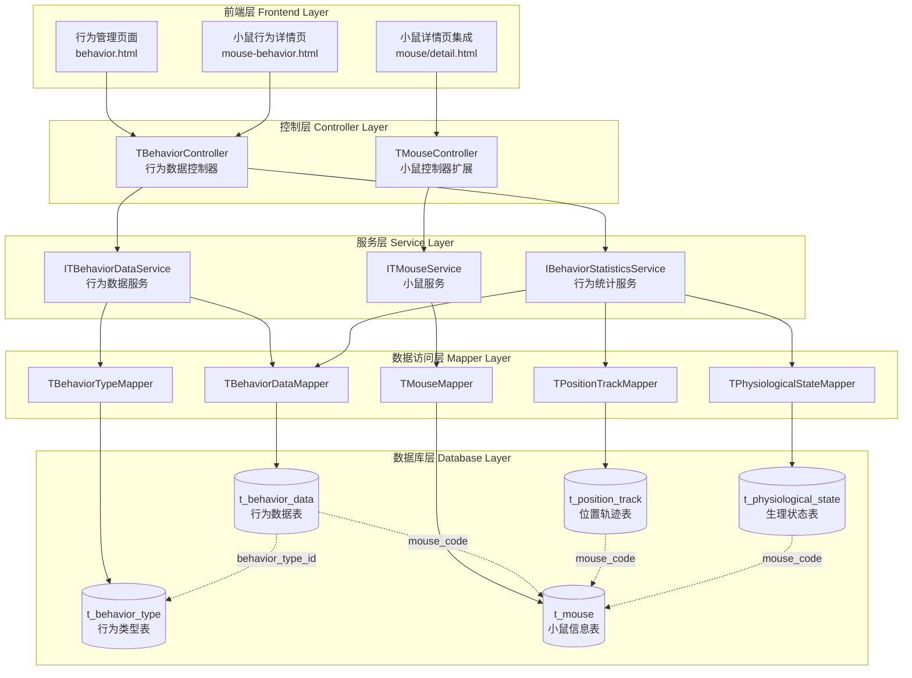
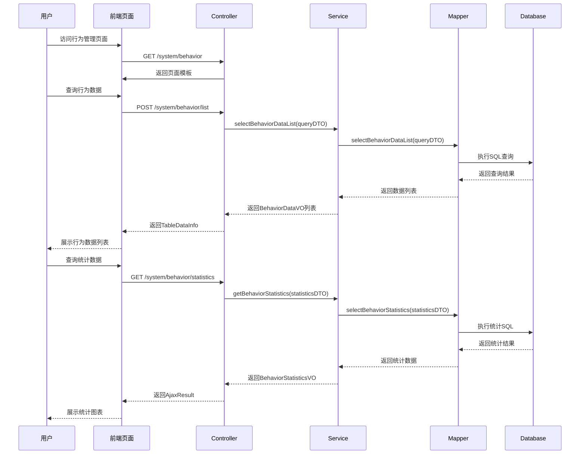

# 小鼠行为记录系统架构设计文档

## 整体架构图



## 分层设计

### 1. 前端展示层 (Presentation Layer)

#### 页面组件设计
```
templates/system/behavior/
├── behavior.html                    # 独立行为管理主页
│   ├── 页面头部 (面包屑导航)
│   ├── 查询条件区域
│   ├── 统计汇总区域
│   └── 行为记录列表区域
├── mouse-behavior.html              # 小鼠行为详情页
│   ├── 小鼠基本信息展示
│   ├── 行为统计图表
│   └── 行为记录时间线
└── fragments/
    ├── behavior-statistics.html     # 统计组件片段
    ├── behavior-list.html          # 列表组件片段
    └── behavior-filter.html        # 筛选组件片段
```

#### JavaScript模块设计
```javascript
// behavior.js - 行为管理主要逻辑
var BehaviorManager = {
    // 初始化页面
    init: function() {},
    // 加载行为列表
    loadBehaviorList: function(params) {},
    // 加载统计数据
    loadStatistics: function(timeRange) {},
    // 筛选条件处理
    handleFilter: function() {},
    // 时间范围选择
    handleTimeRange: function() {}
};

// behavior-statistics.js - 统计组件
var BehaviorStatistics = {
    // 渲染统计图表
    renderChart: function(data) {},
    // 更新统计数据
    updateData: function(data) {}
};
```

### 2. 控制层 (Controller Layer)

#### TBehaviorController 接口设计
```java
@Controller
@RequestMapping("/system/behavior")
public class TBehaviorController {
    
    // 页面路由
    @GetMapping()
    public String behavior();  // 行为管理主页
    
    @GetMapping("/mouse/{mouseCode}")
    public String mouseBehavior(@PathVariable String mouseCode, ModelMap mmap);
    
    // API接口
    @PostMapping("/list")
    @ResponseBody
    public TableDataInfo list(BehaviorQueryDTO queryDTO);
    
    @GetMapping("/statistics")
    @ResponseBody
    public AjaxResult statistics(BehaviorStatisticsDTO statisticsDTO);
    
    @GetMapping("/mouse/{mouseCode}/summary")
    @ResponseBody
    public AjaxResult getMouseBehaviorSummary(@PathVariable String mouseCode);
    
    @GetMapping("/types")
    @ResponseBody
    public AjaxResult getBehaviorTypes();
}
```

### 3. 服务层 (Service Layer)

#### 核心服务接口
```java
// 行为数据服务
public interface ITBehaviorDataService {
    List<BehaviorDataVO> selectBehaviorDataList(BehaviorQueryDTO queryDTO);
    BehaviorStatisticsVO getBehaviorStatistics(BehaviorStatisticsDTO statisticsDTO);
    MouseBehaviorSummaryVO getMouseBehaviorSummary(String mouseCode);
    List<BehaviorDataVO> getRecentBehaviorsByMouse(String mouseCode, int limit);
}

// 行为统计服务
public interface IBehaviorStatisticsService {
    Map<String, Integer> getBehaviorTypeCount(String mouseCode, Date startTime, Date endTime);
    List<BehaviorTrendVO> getBehaviorTrend(String mouseCode, Date startTime, Date endTime);
    PhysiologicalSummaryVO getLatestPhysiologicalState(String mouseCode);
}
```

### 4. 数据访问层 (Mapper Layer)

#### Mapper接口设计
```java
// 行为数据Mapper
public interface TBehaviorDataMapper {
    List<BehaviorDataVO> selectBehaviorDataList(BehaviorQueryDTO queryDTO);
    List<BehaviorStatisticsVO> selectBehaviorStatistics(BehaviorStatisticsDTO statisticsDTO);
    List<BehaviorDataVO> selectRecentBehaviorsByMouse(@Param("mouseCode") String mouseCode, @Param("limit") int limit);
    int countBehaviorsByMouseAndTimeRange(@Param("mouseCode") String mouseCode, @Param("startTime") Date startTime, @Param("endTime") Date endTime);
}

// 行为类型Mapper
public interface TBehaviorTypeMapper {
    List<TBehaviorType> selectAllBehaviorTypes();
    TBehaviorType selectBehaviorTypeById(Long id);
    List<TBehaviorType> selectBehaviorTypesByCategory(String category);
}
```

## 核心组件设计

### 1. 实体类设计

```java
// 行为数据实体
@Data
@TableName("t_behavior_data")
public class TBehaviorData extends BaseEntity {
    @TableId(type = IdType.AUTO)
    private Long id;
    private String deviceCode;
    private String mouseCode;
    private Long experimentId;
    private Long behaviorTypeId;
    private String behaviorValue;
    private BigDecimal confidence;
    private Date timestamp;
    
    // 关联对象
    @TableField(exist = false)
    private TMouse mouse;
    
    @TableField(exist = false)
    private TBehaviorType behaviorType;
}

// 行为数据视图对象
@Data
public class BehaviorDataVO {
    private Long id;
    private String deviceCode;
    private String mouseCode;
    private String mouseName;
    private String cageCode;
    private String behaviorTypeName;
    private String behaviorCategory;
    private String behaviorValue;
    private BigDecimal confidence;
    private Date timestamp;
    private String status;
}

// 行为统计视图对象
@Data
public class BehaviorStatisticsVO {
    private String timeRange;
    private Integer totalBehaviors;
    private Integer basicBehaviors;
    private Integer socialBehaviors;
    private Integer abnormalBehaviors;
    private Map<String, Integer> behaviorTypeCount;
    private List<String> activeMice;
}
```

### 2. 查询参数设计

```java
// 行为查询参数
@Data
public class BehaviorQueryDTO {
    private String mouseCode;
    private String mouseName;
    private Long behaviorTypeId;
    private String behaviorCategory;
    private Date startTime;
    private Date endTime;
    private String deviceCode;
    private Integer pageNum = 1;
    private Integer pageSize = 10;
    private String orderBy = "timestamp DESC";
}

// 统计查询参数
@Data
public class BehaviorStatisticsDTO {
    private String mouseCode;
    private Date startTime;
    private Date endTime;
    private String groupBy = "behavior_category"; // behavior_type, behavior_category, hour
    private String timeUnit = "hour"; // hour, day, week
}
```

## 接口契约定义

### 1. REST API接口

```yaml
# 行为列表查询
POST /system/behavior/list
Request:
  mouseCode: string (optional)
  behaviorTypeId: long (optional)
  startTime: datetime (optional)
  endTime: datetime (optional)
  pageNum: int (default: 1)
  pageSize: int (default: 10)
Response:
  code: int
  msg: string
  rows: BehaviorDataVO[]
  total: int

# 行为统计查询
GET /system/behavior/statistics
Request:
  mouseCode: string (optional)
  startTime: datetime (required)
  endTime: datetime (required)
  groupBy: string (default: "behavior_category")
Response:
  code: int
  msg: string
  data: BehaviorStatisticsVO

# 小鼠行为汇总
GET /system/behavior/mouse/{mouseCode}/summary
Response:
  code: int
  msg: string
  data: MouseBehaviorSummaryVO
```

### 2. 数据库查询接口

```sql
-- 行为数据列表查询
SELECT 
    bd.id,
    bd.device_code,
    bd.mouse_code,
    m.mouse_name,
    m.cage_code,
    bt.type_name as behavior_type_name,
    bt.category as behavior_category,
    bd.behavior_value,
    bd.confidence,
    bd.timestamp,
    m.status
FROM t_behavior_data bd
LEFT JOIN t_mouse m ON bd.mouse_code = m.mouse_code
LEFT JOIN t_behavior_type bt ON bd.behavior_type_id = bt.id
WHERE 1=1
  AND (#{mouseCode} IS NULL OR bd.mouse_code = #{mouseCode})
  AND (#{startTime} IS NULL OR bd.timestamp >= #{startTime})
  AND (#{endTime} IS NULL OR bd.timestamp <= #{endTime})
ORDER BY bd.timestamp DESC
LIMIT #{offset}, #{pageSize};

-- 行为统计查询
SELECT 
    bt.category,
    COUNT(*) as behavior_count,
    COUNT(DISTINCT bd.mouse_code) as mouse_count
FROM t_behavior_data bd
LEFT JOIN t_behavior_type bt ON bd.behavior_type_id = bt.id
WHERE bd.timestamp BETWEEN #{startTime} AND #{endTime}
  AND (#{mouseCode} IS NULL OR bd.mouse_code = #{mouseCode})
GROUP BY bt.category;
```

## 数据流向图



## 异常处理策略

### 1. 业务异常处理
```java
// 自定义业务异常
public class BehaviorException extends RuntimeException {
    private String code;
    private String message;
}

// 全局异常处理
@ControllerAdvice
public class BehaviorExceptionHandler {
    
    @ExceptionHandler(BehaviorException.class)
    public AjaxResult handleBehaviorException(BehaviorException e) {
        return AjaxResult.error(e.getCode(), e.getMessage());
    }
    
    @ExceptionHandler(DataAccessException.class)
    public AjaxResult handleDataAccessException(DataAccessException e) {
        log.error("数据访问异常", e);
        return AjaxResult.error("数据查询失败，请稍后重试");
    }
}
```

### 2. 前端异常处理
```javascript
// AJAX请求统一异常处理
$.ajaxSetup({
    error: function(xhr, status, error) {
        if (xhr.status === 403) {
            $.modal.alertWarning("没有权限访问该功能");
        } else if (xhr.status === 500) {
            $.modal.alertError("服务器内部错误，请联系管理员");
        } else {
            $.modal.alertError("请求失败：" + error);
        }
    }
});

// 业务逻辑异常处理
function handleBehaviorResponse(response) {
    if (response.code === 200) {
        return response.data;
    } else {
        $.modal.alertWarning(response.msg || "操作失败");
        return null;
    }
}
```

## 性能优化设计

### 1. 数据库优化
```sql
-- 核心查询索引
CREATE INDEX idx_behavior_mouse_time ON t_behavior_data(mouse_code, timestamp DESC);
CREATE INDEX idx_behavior_type_time ON t_behavior_data(behavior_type_id, timestamp DESC);
CREATE INDEX idx_behavior_device_time ON t_behavior_data(device_code, timestamp DESC);
CREATE INDEX idx_physio_mouse_time ON t_physiological_state(mouse_code, timestamp DESC);
CREATE INDEX idx_position_mouse_time ON t_position_track(mouse_code, timestamp DESC);

-- 统计查询优化
CREATE INDEX idx_behavior_category_time ON t_behavior_data(behavior_type_id, timestamp);
```

### 2. 缓存策略
```java
// 行为类型字典缓存
@Service
public class BehaviorTypeService {
    
    @Cacheable(value = "behaviorTypes", key = "'all'")
    public List<TBehaviorType> getAllBehaviorTypes() {
        return behaviorTypeMapper.selectAllBehaviorTypes();
    }
    
    @Cacheable(value = "behaviorTypes", key = "#category")
    public List<TBehaviorType> getBehaviorTypesByCategory(String category) {
        return behaviorTypeMapper.selectBehaviorTypesByCategory(category);
    }
}
```

### 3. 分页优化
```java
// 大数据量分页优化
public class BehaviorDataServiceImpl implements ITBehaviorDataService {
    
    @Override
    public List<BehaviorDataVO> selectBehaviorDataList(BehaviorQueryDTO queryDTO) {
        // 使用游标分页替代传统分页
        if (queryDTO.getPageSize() > 1000) {
            return selectBehaviorDataListByCursor(queryDTO);
        }
        return behaviorDataMapper.selectBehaviorDataList(queryDTO);
    }
}
```

## 安全设计

### 1. 权限控制
```java
// 权限点定义
public class BehaviorPermissions {
    public static final String BEHAVIOR_VIEW = "system:behavior:view";
    public static final String BEHAVIOR_LIST = "system:behavior:list";
    public static final String BEHAVIOR_STATISTICS = "system:behavior:statistics";
    public static final String BEHAVIOR_EXPORT = "system:behavior:export";
}

// Controller权限控制
@RequiresPermissions("system:behavior:view")
@GetMapping()
public String behavior() {
    return "system/behavior/behavior";
}

@RequiresPermissions("system:behavior:list")
@PostMapping("/list")
@ResponseBody
public TableDataInfo list(BehaviorQueryDTO queryDTO) {
    // 业务逻辑
}
```

### 2. 数据安全
```java
// 参数验证
@Data
@Valid
public class BehaviorQueryDTO {
    @Pattern(regexp = "^[A-Za-z0-9_-]{1,50}$", message = "小鼠编码格式不正确")
    private String mouseCode;
    
    @DateTimeFormat(pattern = "yyyy-MM-dd HH:mm:ss")
    @Past(message = "开始时间不能是未来时间")
    private Date startTime;
    
    @DateTimeFormat(pattern = "yyyy-MM-dd HH:mm:ss")
    @Future(message = "结束时间不能是过去时间")
    private Date endTime;
    
    @Min(value = 1, message = "页码必须大于0")
    @Max(value = 1000, message = "页码不能超过1000")
    private Integer pageNum = 1;
    
    @Min(value = 1, message = "页面大小必须大于0")
    @Max(value = 100, message = "页面大小不能超过100")
    private Integer pageSize = 10;
}
```

## 监控和日志

### 1. 操作日志
```java
// 关键操作日志记录
@Log(title = "行为数据", businessType = BusinessType.OTHER)
@GetMapping("/statistics")
@ResponseBody
public AjaxResult statistics(BehaviorStatisticsDTO statisticsDTO) {
    // 业务逻辑
}
```

### 2. 性能监控
```java
// 方法执行时间监控
@Around("execution(* com.ruoyi.system.service.impl.*BehaviorService*.*(..))")
public Object monitorPerformance(ProceedingJoinPoint joinPoint) throws Throwable {
    long startTime = System.currentTimeMillis();
    Object result = joinPoint.proceed();
    long endTime = System.currentTimeMillis();
    
    if (endTime - startTime > 3000) { // 超过3秒记录警告
        log.warn("方法执行时间过长: {} 耗时: {}ms", 
                joinPoint.getSignature().getName(), endTime - startTime);
    }
    
    return result;
}
```

---

**设计完成时间**: 2025-01-21
**架构复杂度**: 中等
**预计开发时间**: 3小时
**技术风险**: 低