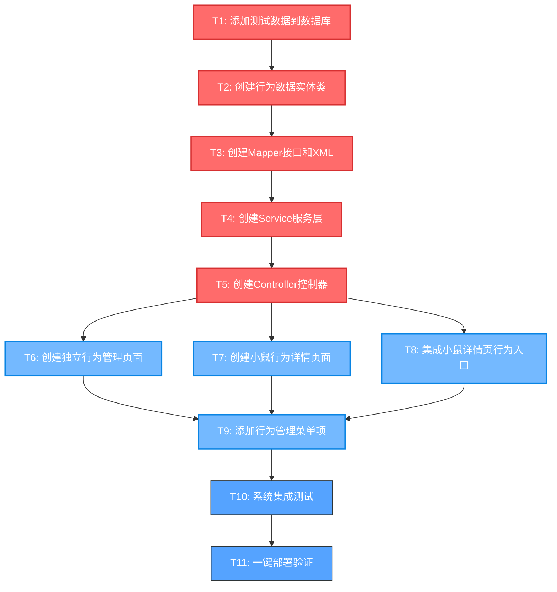

# 小鼠行为记录系统任务拆分文档

## 任务依赖图

## 原子任务详细定义

### T1: 添加测试数据到数据库

**任务描述**: 为新创建的行为数据表添加测试数据，并同步到初始化脚本

**输入契约**:
- 前置依赖: 数据库表已创建 (t_behavior_type, t_behavior_data, t_position_track, t_physiological_state)
- 输入数据: 现有 t_mouse 表中的小鼠数据
- 环境依赖: MySQL数据库运行，Docker容器可访问

**输出契约**:
- 输出数据: 包含测试数据的SQL脚本文件
- 交付物: 
  - `d:\mouse\database\test_data.sql` - 测试数据脚本
  - `d:\mouse\database\init.sql` - 更新后的初始化脚本
- 验收标准: 
  - 每个表至少包含10条测试数据
  - 外键关系正确 (mouse_code关联t_mouse表)
  - 时间数据覆盖最近7天
  - 行为类型覆盖所有category

**实现约束**:
- 技术栈: SQL, MySQL
- 接口规范: 遵循现有数据库字段约束
- 质量要求: 数据真实性，外键完整性

**依赖关系**:
- 后置任务: T2 (需要测试数据验证实体类)
- 并行任务: 无

---

### T2: 创建行为数据实体类

**任务描述**: 创建行为数据相关的实体类、VO类和DTO类

**输入契约**:
- 前置依赖: T1完成，数据库表结构确定
- 输入数据: 数据库表结构定义
- 环境依赖: Java开发环境，现有项目结构

**输出契约**:
- 输出数据: Java实体类文件
- 交付物:
  - `TBehaviorData.java` - 行为数据实体
  - `TBehaviorType.java` - 行为类型实体
  - `TPositionTrack.java` - 位置轨迹实体
  - `TPhysiologicalState.java` - 生理状态实体
  - `BehaviorDataVO.java` - 行为数据视图对象
  - `BehaviorQueryDTO.java` - 查询参数对象
  - `BehaviorStatisticsVO.java` - 统计视图对象
- 验收标准:
  - 实体类包含所有数据库字段
  - 使用MyBatis-Plus注解
  - 包含关联对象属性
  - 遵循项目命名规范

**实现约束**:
- 技术栈: Java, MyBatis-Plus, Lombok
- 接口规范: 遵循现有实体类模式
- 质量要求: 代码规范，注释完整

**依赖关系**:
- 前置任务: T1
- 后置任务: T3
- 并行任务: 无

---

### T3: 创建Mapper接口和XML

**任务描述**: 创建数据访问层Mapper接口和对应的XML映射文件

**输入契约**:
- 前置依赖: T2完成，实体类已创建
- 输入数据: 实体类定义，查询需求
- 环境依赖: MyBatis框架，现有Mapper模式

**输出契约**:
- 输出数据: Mapper接口和XML文件
- 交付物:
  - `TBehaviorDataMapper.java` - 行为数据Mapper接口
  - `TBehaviorTypeMapper.java` - 行为类型Mapper接口
  - `TPositionTrackMapper.java` - 位置轨迹Mapper接口
  - `TPhysiologicalStateMapper.java` - 生理状态Mapper接口
  - 对应的XML映射文件
- 验收标准:
  - 包含基础CRUD操作
  - 包含复杂查询方法 (统计、关联查询)
  - SQL语句优化，使用索引
  - 支持分页查询

**实现约束**:
- 技术栈: MyBatis, MySQL
- 接口规范: 遵循现有Mapper命名规范
- 质量要求: SQL性能优化，防SQL注入

**依赖关系**:
- 前置任务: T2
- 后置任务: T4
- 并行任务: 无

---

### T4: 创建Service服务层

**任务描述**: 创建业务逻辑服务层，包含接口和实现类

**输入契约**:
- 前置依赖: T3完成，Mapper层已创建
- 输入数据: Mapper接口，业务需求
- 环境依赖: Spring框架，现有Service模式

**输出契约**:
- 输出数据: Service接口和实现类
- 交付物:
  - `ITBehaviorDataService.java` - 行为数据服务接口
  - `TBehaviorDataServiceImpl.java` - 行为数据服务实现
  - `IBehaviorStatisticsService.java` - 行为统计服务接口
  - `BehaviorStatisticsServiceImpl.java` - 行为统计服务实现
- 验收标准:
  - 包含所有业务方法
  - 事务管理正确
  - 异常处理完善
  - 缓存策略合理

**实现约束**:
- 技术栈: Spring, Spring Transaction
- 接口规范: 遵循现有Service模式
- 质量要求: 业务逻辑清晰，异常处理完善

**依赖关系**:
- 前置任务: T3
- 后置任务: T5
- 并行任务: 无

---

### T5: 创建Controller控制器

**任务描述**: 创建Web控制器，提供REST API和页面路由

**输入契约**:
- 前置依赖: T4完成，Service层已创建
- 输入数据: Service接口，API需求
- 环境依赖: Spring MVC，现有Controller模式

**输出契约**:
- 输出数据: Controller类文件
- 交付物:
  - `TBehaviorController.java` - 行为数据控制器
  - 扩展 `TMouseController.java` - 小鼠控制器扩展
- 验收标准:
  - 包含所有API端点
  - 参数验证完整
  - 权限控制正确
  - 返回格式统一

**实现约束**:
- 技术栈: Spring MVC, Spring Security
- 接口规范: 遵循RESTful API规范
- 质量要求: 参数验证，权限控制，异常处理

**依赖关系**:
- 前置任务: T4
- 后置任务: T6, T7, T8
- 并行任务: 无

---

### T6: 创建独立行为管理页面

**任务描述**: 创建独立的行为管理主页面，包含列表展示和统计功能

**输入契约**:
- 前置依赖: T5完成，Controller API可用
- 输入数据: API接口定义，UI设计需求
- 环境依赖: Thymeleaf模板引擎，现有前端框架

**输出契约**:
- 输出数据: HTML模板和JavaScript文件
- 交付物:
  - `templates/system/behavior/behavior.html` - 主页面模板
  - `static/js/behavior/behavior.js` - 页面逻辑脚本
  - `static/css/behavior/behavior.css` - 页面样式 (如需要)
- 验收标准:
  - 页面布局美观，响应式设计
  - 功能完整 (查询、筛选、分页、统计)
  - 与后端API集成正常
  - 用户体验良好

**实现约束**:
- 技术栈: Thymeleaf, jQuery, Bootstrap
- 接口规范: 遵循现有页面模式
- 质量要求: 用户体验，性能优化，兼容性

**依赖关系**:
- 前置任务: T5
- 后置任务: T9
- 并行任务: T7, T8

---

### T7: 创建小鼠行为详情页面

**任务描述**: 创建小鼠行为详情页面，展示特定小鼠的行为信息

**输入契约**:
- 前置依赖: T5完成，Controller API可用
- 输入数据: API接口定义，小鼠详情需求
- 环境依赖: Thymeleaf模板引擎，现有前端框架

**输出契约**:
- 输出数据: HTML模板和JavaScript文件
- 交付物:
  - `templates/system/behavior/mouse-behavior.html` - 小鼠行为详情页
  - `static/js/behavior/mouse-behavior.js` - 页面逻辑脚本
- 验收标准:
  - 展示小鼠基本信息
  - 行为统计图表展示
  - 行为记录时间线
  - 支持时间范围筛选

**实现约束**:
- 技术栈: Thymeleaf, jQuery, Chart.js
- 接口规范: 遵循现有页面模式
- 质量要求: 数据可视化，交互体验

**依赖关系**:
- 前置任务: T5
- 后置任务: T9
- 并行任务: T6, T8

---

### T8: 集成小鼠详情页行为入口

**任务描述**: 在现有小鼠详情页面添加行为信息入口和展示

**输入契约**:
- 前置依赖: T5完成，T7完成
- 输入数据: 现有小鼠详情页面，行为详情页面
- 环境依赖: 现有小鼠管理模块

**输出契约**:
- 输出数据: 修改后的小鼠详情页面
- 交付物:
  - 修改 `templates/system/mouse/detail.html`
  - 修改 `static/js/system/mouse.js`
- 验收标准:
  - 详情页面添加"行为信息"按钮
  - 点击按钮跳转到行为详情页
  - 传递正确的小鼠编码参数
  - 不影响现有功能

**实现约束**:
- 技术栈: 现有技术栈
- 接口规范: 不破坏现有接口
- 质量要求: 向后兼容，无副作用

**依赖关系**:
- 前置任务: T5, T7
- 后置任务: T9
- 并行任务: T6

---

### T9: 添加行为管理菜单项

**任务描述**: 在系统菜单中添加行为管理菜单项

**输入契约**:
- 前置依赖: T6, T7, T8完成
- 输入数据: 现有菜单结构，权限配置
- 环境依赖: 系统菜单管理模块

**输出契约**:
- 输出数据: 菜单配置SQL脚本
- 交付物:
  - `database/menu_behavior.sql` - 菜单配置脚本
  - 更新权限配置
- 验收标准:
  - 菜单项正确显示
  - 权限控制正常
  - 菜单层级合理
  - 图标和名称规范

**实现约束**:
- 技术栈: SQL, 系统权限框架
- 接口规范: 遵循现有菜单规范
- 质量要求: 权限安全，用户体验

**依赖关系**:
- 前置任务: T6, T7, T8
- 后置任务: T10
- 并行任务: 无

---

### T10: 系统集成测试

**任务描述**: 对整个行为记录系统进行集成测试

**输入契约**:
- 前置依赖: T9完成，所有功能模块已实现
- 输入数据: 完整的系统功能
- 环境依赖: 测试环境，测试数据

**输出契约**:
- 输出数据: 测试报告
- 交付物:
  - `docs/行为记录系统/TEST_REPORT.md` - 测试报告
  - 修复的Bug列表
- 验收标准:
  - 所有功能正常运行
  - 页面跳转正确
  - 数据展示准确
  - 性能满足要求

**实现约束**:
- 技术栈: 手动测试，自动化测试
- 接口规范: 遵循测试规范
- 质量要求: 测试覆盖率，缺陷修复

**依赖关系**:
- 前置任务: T9
- 后置任务: T11
- 并行任务: 无

---

### T11: 一键部署验证

**任务描述**: 使用一键部署脚本验证整个系统

**输入契约**:
- 前置依赖: T10完成，集成测试通过
- 输入数据: 完整的项目代码
- 环境依赖: Docker环境，部署脚本

**输出契约**:
- 输出数据: 部署验证报告
- 交付物:
  - 部署成功的系统
  - `docs/行为记录系统/DEPLOYMENT_REPORT.md` - 部署报告
- 验收标准:
  - 一键部署脚本执行成功
  - 系统启动正常
  - 所有功能可访问
  - 数据库连接正常

**实现约束**:
- 技术栈: PowerShell, Docker
- 接口规范: 遵循部署规范
- 质量要求: 部署稳定性，环境一致性

**依赖关系**:
- 前置任务: T10
- 后置任务: 无
- 并行任务: 无

---

## 任务执行计划

### 第一阶段: 数据层建设 (预计1小时)
- T1: 添加测试数据到数据库 (20分钟)
- T2: 创建行为数据实体类 (25分钟)
- T3: 创建Mapper接口和XML (15分钟)

### 第二阶段: 业务层开发 (预计45分钟)
- T4: 创建Service服务层 (25分钟)
- T5: 创建Controller控制器 (20分钟)

### 第三阶段: 前端页面开发 (预计1小时15分钟)
- T6: 创建独立行为管理页面 (30分钟)
- T7: 创建小鼠行为详情页面 (25分钟)
- T8: 集成小鼠详情页行为入口 (10分钟)
- T9: 添加行为管理菜单项 (10分钟)

### 第四阶段: 测试验证 (预计30分钟)
- T10: 系统集成测试 (20分钟)
- T11: 一键部署验证 (10分钟)

**总预计时间**: 3小时30分钟

## 风险评估

### 高风险任务
- T3: Mapper接口和XML - SQL复杂度较高
- T6: 独立行为管理页面 - 前端交互复杂
- T10: 系统集成测试 - 可能发现集成问题

### 风险缓解策略
- 参考现有代码模式，降低实现复杂度
- 分步骤验证，及时发现问题
- 保持代码简洁，避免过度设计

### 关键成功因素
- 严格遵循现有项目规范
- 保持与现有系统的一致性
- 充分的测试验证
- 及时的问题反馈和修复

---

**文档创建时间**: 2025-01-21
**任务复杂度**: 中等
**预计完成时间**: 3.5小时
**风险等级**: 中等