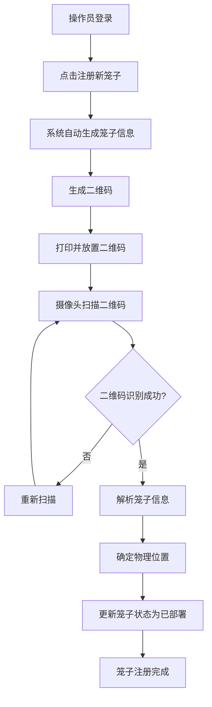
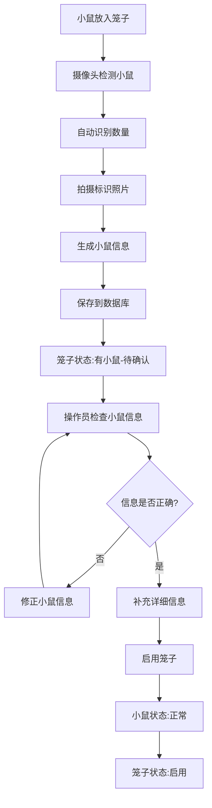
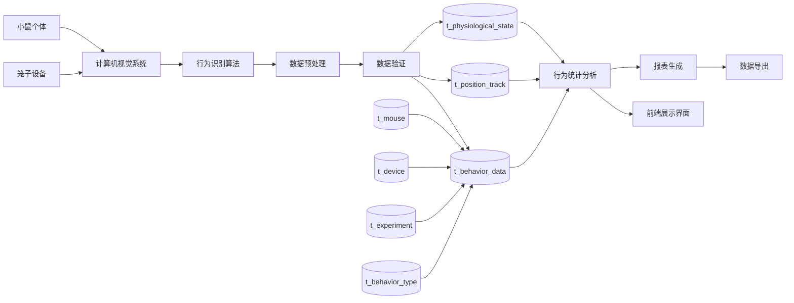
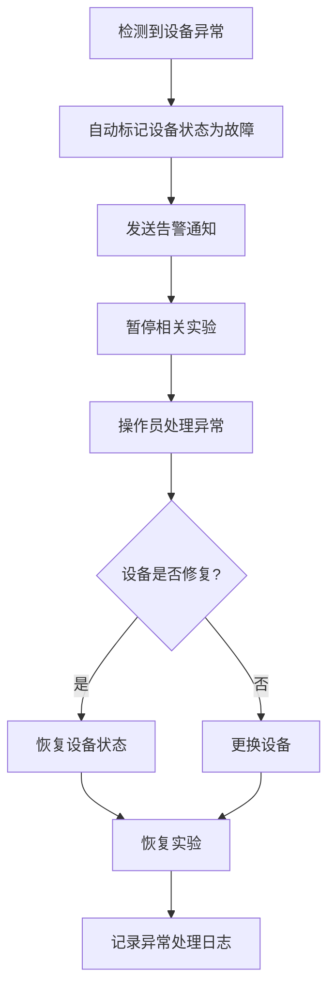
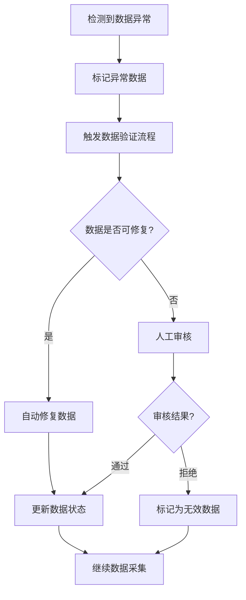

# 视觉小鼠管理系统业务流程指南

## 全流程概览

视觉小鼠管理系统是一个集成了物联网、计算机视觉、数据分析和实验管理的智能化平台。系统通过自动化技术实现从实验准备到数据分析的全流程管理，为科研人员提供高效、准确的小鼠行为研究工具。

### 核心流程架构

整个系统围绕**笼子-小鼠-实验-数据**四个核心要素构建，通过以下六个主要阶段实现完整的实验管理：

1. **实验环境准备阶段**
   - 笼子注册与二维码生成
   - 摄像头系统配置与校准
   - 设备状态检查与网络连接

2. **小鼠信息采集阶段**
   - 二维码扫描识别笼子
   - 计算机视觉自动识别小鼠
   - 人工确认与信息完善
   - 笼子状态激活

3. **实验设计与配置阶段**
   - 创建实验项目
   - 选择参与笼子和小鼠
   - 配置跟踪参数（时间、频率、行为类型）
   - 实验启动与监控

4. **数据采集与处理阶段**
   - 实时行为数据采集
   - 多维度数据验证与清洗
   - 行为分类与轨迹分析
   - 数据质量监控

5. **实时监控与分析阶段**
   - 行为统计图表展示
   - 小鼠活动轨迹可视化
   - 异常行为预警
   - 实验进度跟踪

6. **数据分析与报表生成阶段**
   - 多层次数据挖掘分析
   - 统计指标计算与置信区间
   - 自动化报表生成
   - 多格式导出与分享

### 技术特色与优势

- **全自动化流程**：从小鼠识别到数据分析，最大程度减少人工干预
- **实时数据处理**：毫秒级数据采集与处理，确保实验数据的时效性
- **智能质量控制**：多层次数据验证机制，保证数据准确性和可靠性
- **灵活配置管理**：支持多种实验参数配置，适应不同研究需求
- **可视化分析**：丰富的图表展示和交互式数据探索功能

### 用户角色与权限

系统支持两种主要用户角色：
- **操作员**：负责日常实验操作、数据监控和基础分析
- **审计员**：具备完整系统权限，负责实验审核、高级分析和系统管理

## 文档概述

本文档详细描述了计算机视觉小鼠管理系统的完整业务流程，涵盖操作员和审计员两种用户角色的操作流程。系统从添加笼子开始，逐步完成设备管理、小鼠管理、实验管理和行为数据监控的全流程操作。

## 用户角色定义

### 操作员 (Operator)
- **权限范围**: 日常操作权限，包括设备管理、小鼠管理、实验创建和数据录入
- **主要职责**: 系统日常运维、数据录入、设备监控、实验执行
- **操作限制**: 不能删除关键数据，不能修改系统配置

### 审计员 (Auditor)
- **权限范围**: 查看和审核权限，包括数据查询、报表生成、质量审核
- **主要职责**: 数据审核、质量控制、报表分析、合规检查
- **操作限制**: 只读权限，不能修改业务数据

## 核心业务流程

### 1. 设备管理流程

#### 1.1 笼子注册与二维码生成 (操作员)

**自然语言描述**:
1. 操作员登录系统，进入设备管理页面
2. 点击"注册新笼子"按钮，系统自动生成笼子信息:
   - 设备编号 (device_code): 系统自动生成唯一标识，如 "CAGE_001"
   - 设备名称 (device_name): 自动命名，如 "1号笼子"
   - 设备类型 (device_type): 默认为 "CAGE" (笼子类型)
   - 设备位置 (location): 待扫描确认
   - 设备状态 (status): 初始状态为 "待部署"
3. 系统生成包含笼子信息的二维码
4. 操作员打印二维码并物理放置到笼子位置
5. 笼子状态更新为"待扫描"

#### 1.2 笼子扫描识别与激活 (系统自动)

**自然语言描述**:
1. 摄像头系统扫描识别笼子上的二维码
2. 系统解析二维码获取笼子编号和基本信息
3. 自动确定笼子的物理位置坐标
4. 更新笼子位置信息到 t_device 表
5. 笼子状态更新为"已部署"，等待小鼠添加
6. 系统记录笼子激活时间和位置信息

**流程图**:


#### 1.2 设备状态监控 (操作员/审计员)

**自然语言描述**:
1. 用户进入设备管理页面
2. 查看设备列表，显示所有设备状态
3. 设备状态包括: 正常(0)、故障(1)、维护(2)
4. 操作员可以更新设备状态
5. 审计员只能查看设备状态和历史记录
6. 系统记录状态变更日志

### 2. 小鼠管理流程

#### 2.1 小鼠自动识别与信息采集 (系统自动)

**自然语言描述**:
1. 操作员将小鼠放入已部署的笼子中
2. 摄像头系统自动检测笼子内的小鼠
3. 系统自动识别和统计小鼠数量
4. 为每只小鼠拍摄照片作为身份标识
5. 系统自动生成小鼠基本信息:
   - 小鼠编号 (mouse_code): 基于笼子编号自动生成，如 "CAGE_001_M001"
   - 小鼠照片 (photo): 系统拍摄的标识照片
   - 检测时间 (detected_time): 首次检测到的时间
   - 所属笼子 (device_id): 自动关联笼子信息
   - 初始状态 (status): 设置为"待确认"
6. 系统将小鼠信息保存到 t_mouse 表
7. 笼子状态更新为"有小鼠-待确认"

#### 2.2 小鼠信息人工确认与笼子启用 (操作员)

**自然语言描述**:
1. 操作员进入小鼠管理页面，查看待确认的小鼠列表
2. 逐一检查系统识别的小鼠信息:
   - 确认小鼠数量是否正确
   - 检查小鼠照片质量
   - 补充小鼠详细信息（性别、品种、健康状态等）
3. 对每只小鼠进行人工标记和验证
4. 确认无误后，操作员点击"启用笼子"按钮
5. 系统更新所有小鼠状态为"正常"
6. 笼子状态更新为"启用"，可用于实验
7. 记录启用时间和操作员信息

**流程图**:


### 3. 实验管理流程

#### 3.1 创建实验项目 (操作员)

**自然语言描述**:
1. 操作员进入实验管理页面
2. 点击"新建实验"按钮
3. 填写实验基本信息:
   - 实验编号 (experiment_code): 系统自动生成唯一标识
   - 实验名称 (experiment_name): 实验项目名称
   - 实验类型 (experiment_type): 行为学/生理学/药理学等
   - 实验描述 (description): 详细实验说明
   - 负责人 (principal_investigator): 实验负责人
4. 选择参与实验的笼子:
   - 从已启用的笼子列表中选择多个笼子
   - 系统自动关联笼子内的所有小鼠
   - 显示每个笼子的小鼠数量和状态
5. 保存实验信息到 t_experiment 表
6. 实验状态设置为"准备中"

#### 3.2 实验参数配置 (操作员)

**自然语言描述**:
1. 在实验详情页面进行参数配置:
   - 跟踪时间设置: 设定实验的开始和结束时间
   - 采集频率配置: 设置数据采集的时间间隔（如每秒、每分钟）
   - 监控侧重点: 选择重点关注的行为类型
   - 数据质量要求: 设置数据采集的精度和可信度阈值
   - 告警规则: 配置异常行为的告警条件
2. 系统验证配置参数的合理性
3. 保存配置信息并关联到实验
4. 确认配置后可启动实验

#### 3.3 启动实验 (操作员)

**自然语言描述**:
1. 操作员确认所有配置无误后点击"启动实验"
2. 系统检查实验前置条件:
   - 所有关联笼子状态为"启用"
   - 所有小鼠状态为"正常"
   - 摄像头设备工作正常
3. 系统初始化数据采集模块
4. 实验状态更新为"进行中"
5. 开始正式的数据采集和行为监控
6. 记录实验启动时间和操作员信息

### 4. 行为数据监控流程

#### 4.1 实时数据采集与推送 (系统自动)

**自然语言描述**:
1. 摄像头系统持续监控笼子内的小鼠行为
2. 计算机视觉算法实时识别小鼠行为类型:
   - 基础行为: 静止、行走、跑步、跳跃等
   - 社交行为: 互动、追逐、打斗等
   - 异常行为: 刻板行为、异常姿态等
3. 系统将识别结果封装成JSON报文格式
4. 通过网络接口向服务器终端实时推送数据:
   ```json
   {
     "timestamp": "2024-01-15T10:30:45.123Z",
     "cage_id": "CAGE_001",
     "mouse_id": "CAGE_001_M001",
     "behavior_type": "running",
     "confidence": 0.95,
     "position": {"x": 120, "y": 80},
     "duration": 2.5
   }
   ```
5. 数据推送频率根据实验配置的采集频率执行

#### 4.2 服务器数据接收与处理 (系统自动)

**自然语言描述**:
1. 服务器终端接收来自摄像头系统的JSON报文
2. 数据验证和预处理:
   - 验证报文格式和数据完整性
   - 检查数据的时间戳和序列性
   - 过滤异常和重复数据
3. 数据分类和聚拢处理:
   - 按小鼠编号分类存储行为数据
   - 按时间窗口聚合统计信息
   - 计算行为持续时间和频次
   - 生成实时统计指标
4. 数据存储到相应数据表:
   - 原始行为数据保存到 t_behavior_data 表
   - 位置轨迹数据保存到 t_position_track 表
   - 聚合统计数据保存到汇总表
5. 触发实时数据更新事件，通知前端页面刷新

#### 4.3 实时数据展示 (操作员/审计员)

**自然语言描述**:
1. 用户进入行为监控页面，查看实时数据展示
2. 页面实时更新显示内容:
   - 实时行为统计图表: 各种行为类型的实时计数
   - 小鼠活动轨迹图: 显示小鼠在笼子中的移动路径
   - 行为时间线: 按时间顺序显示行为变化
   - 异常行为告警: 突出显示异常或关注的行为
3. 多维度数据筛选和查看:
   - 按实验、笼子、小鼠筛选数据
   - 按时间范围查看历史数据
   - 按行为类型过滤显示
4. 数据质量监控:
   - 显示数据采集状态和质量指标
   - 展示数据可信度和置信区间
   - 标记数据异常和缺失情况

### 5. 数据分析与报表生成流程

#### 5.1 数据处理与挖掘 (系统自动)

**自然语言描述**:
1. 系统基于小鼠信息确定数据分析范围:
   - 根据小鼠品种、性别、年龄等属性分组分析
   - 按实验类型和时间段划分数据集
   - 识别数据的完整性和可信度
2. 执行多层次数据挖掘分析:
   - 行为模式识别: 发现小鼠的行为规律和周期性
   - 异常行为检测: 识别偏离正常模式的行为
   - 相关性分析: 分析不同行为之间的关联关系
   - 趋势分析: 识别行为随时间的变化趋势
3. 计算统计指标和置信区间:
   - 各行为类型的频次统计和分布
   - 行为持续时间的均值、方差和置信区间
   - 小鼠活动强度和活跃度指标
   - 数据质量评估和可信度评分
4. 生成数据分析结果和洞察报告

#### 5.2 报表生成与文档整理 (操作员/审计员)

**自然语言描述**:
1. 用户进入报表管理页面，选择报表生成参数:
   - 选择分析的实验、时间范围和小鼠群体
   - 设定报表类型: 综合报告、行为分析报告、异常报告等
   - 配置统计指标和图表类型
2. 系统自动生成多格式报表文档:
   - **数据表格**: 包含详细的统计数据和计算结果
   - **可视化图表**: 行为分布图、趋势图、热力图等
   - **置信区间文档**: 统计学分析结果和可信度评估
   - **分析洞察**: 基于数据挖掘的发现和建议
3. 报表内容包括:
   - 实验基本信息和参与小鼠概况
   - 各行为类型的统计分析结果
   - 异常行为检测和告警记录
   - 数据质量评估和置信区间
   - 结论和建议
4. 支持多种格式导出:
   - PDF格式: 完整的分析报告文档
   - Excel格式: 详细数据表格和统计结果
   - CSV格式: 原始数据和处理后数据
   - 图片格式: 各类统计图表和可视化结果

#### 5.3 报表下载与分享 (操作员/审计员)

**自然语言描述**:
1. 用户在报表列表中查看已生成的报表
2. 可预览报表内容和质量
3. 选择需要的报表格式进行下载
4. 支持报表分享和权限控制:
   - 生成报表分享链接
   - 设置访问权限和有效期
   - 记录下载和访问日志
5. 报表归档和版本管理:
   - 自动保存报表历史版本
   - 支持报表对比和差异分析
   - 长期存储和备份管理

## 完整业务流程图

```mermaid
flowchart TD
    %% 用户登录
    A[用户登录系统] --> B{用户角色?}
    B -->|操作员| C[操作员工作台]
    B -->|审计员| D[审计员工作台]
    
    %% 操作员流程 - 笼子管理
    C --> E[笼子注册]
    E --> E1[生成二维码]
    E1 --> E2[放置二维码到笼子]
    E2 --> E3[摄像头扫描识别]
    E3 --> E4[笼子激活完成]
    
    %% 小鼠管理
    E4 --> F[放入小鼠]
    F --> F1[系统自动识别小鼠]
    F1 --> F2[拍摄小鼠照片]
    F2 --> F3[生成小鼠信息]
    F3 --> F4[人工确认小鼠信息]
    F4 --> F5[启用笼子]
    
    %% 实验管理
    F5 --> G[创建实验]
    G --> G1[选择多个笼子]
    G1 --> G2[自动关联小鼠]
    G2 --> G3[配置实验参数]
    G3 --> G4[设置采集频率]
    G4 --> G5[启动实验]
    
    %% 数据采集与处理
    G5 --> H[摄像头监控]
    H --> H1[行为识别]
    H1 --> H2[JSON报文推送]
    H2 --> H3[服务器接收处理]
    H3 --> H4[数据分类聚拢]
    H4 --> H5[实时数据展示]
    
    %% 数据分析
    H5 --> I[数据挖掘分析]
    I --> I1[计算置信区间]
    I1 --> I2[生成分析报告]
    I2 --> I3[多格式报表]
    
    %% 审计员流程
    D --> K[数据查看权限]
    K --> K1[实时监控页面]
    K1 --> K2[历史数据分析]
    K2 --> K3[报表审核]
    
    %% 共同流程 - 报表下载
    I3 --> L[报表预览]
    K3 --> L
    L --> M[选择下载格式]
    M --> N[PDF/Excel/CSV下载]
    N --> O[报表分享]
    O --> P[流程结束]
    
    %% 样式定义
    classDef operatorClass fill:#e1f5fe
    classDef auditorClass fill:#f3e5f5
    classDef systemClass fill:#e8f5e8
    classDef dataClass fill:#fff3e0
    classDef reportClass fill:#f1f8e9
    
    class C,E,E1,E2,F,F4,F5,G,G1,G2,G3,G4,G5 operatorClass
    class D,K,K1,K2,K3 auditorClass
    class E3,E4,F1,F2,F3,H,H1,H2,H3,H4 systemClass
    class H5,I,I1,I2 dataClass
    class I3,L,M,N,O reportClass
```



## 数据流向图



## 关键业务规则

### 1. 数据完整性规则
- 小鼠必须分配到笼子后才能开始实验
- 实验必须关联至少一只小鼠才能启动
- 行为数据必须关联有效的小鼠和设备
- 删除操作需要检查数据关联关系

### 2. 权限控制规则
- 操作员: 具有增删改查权限，但不能删除正在进行的实验数据
- 审计员: 只有查看和导出权限，不能修改任何业务数据
- 系统管理员: 具有所有权限，包括用户管理和系统配置

### 3. 数据质量规则
- 设备编号和小鼠编号必须唯一
- 行为数据采集频率不低于每秒1次
- 异常数据自动标记并提醒人工审核
- 数据备份每日自动执行

### 4. 业务流程规则
- 设备添加 → 小鼠管理 → 实验创建 → 数据采集的顺序不可颠倒
- 实验进行中不允许修改关键参数
- 数据采集异常时自动暂停实验并发送告警
- 实验结束后数据自动归档

## 异常处理流程

### 1. 设备异常处理


### 2. 数据异常处理


## 系统集成接口

### 1. 外部系统接口
- **计算机视觉模块**: 提供行为识别和位置追踪数据
- **环境监控系统**: 提供温湿度、光照等环境数据
- **实验室管理系统**: 同步实验计划和人员信息

### 2. 数据同步机制
- 实时数据同步: 行为数据和位置数据
- 定时数据同步: 实验状态和设备状态
- 批量数据同步: 历史数据和报表数据

## 性能指标要求

### 1. 响应时间要求
- 页面加载时间: < 3秒
- 数据查询响应: < 2秒
- 实时数据更新: < 1秒
- 报表生成时间: < 30秒

### 2. 数据处理能力
- 支持同时监控: 100个笼子
- 数据采集频率: 每秒1000条记录
- 数据存储容量: 支持1年以上历史数据
- 并发用户数: 50个用户同时在线

## 总结

本业务流程指南详细描述了计算机视觉小鼠管理系统的完整自动化操作流程，核心特点如下：

### 核心流程特色
1. **智能化笼子管理**: 通过二维码生成和摄像头扫描实现笼子的自动注册和激活
2. **自动化小鼠识别**: 系统自动检测、计数和拍照，减少人工干预
3. **灵活的实验配置**: 支持多笼子选择和自动小鼠关联，可配置采集频率和监控重点
4. **实时数据处理**: JSON报文推送和服务器端数据分类聚拢，确保数据实时性
5. **智能数据分析**: 基于小鼠属性的数据挖掘和置信区间计算
6. **多格式报表输出**: 支持PDF、Excel、CSV等多种格式的报表下载和分享

### 技术优势
- **高度自动化**: 从笼子识别到数据分析的全流程自动化处理
- **数据可信度**: 通过置信区间计算和数据质量评估确保结果可靠性
- **实时性保障**: JSON报文推送机制确保数据的实时传输和处理
- **灵活配置**: 支持实验参数的灵活配置和多维度数据分析

### 用户价值
- **操作员**: 简化操作流程，提高工作效率，减少人为错误
- **审计员**: 获得高质量的数据分析报告和可信的统计结果
- **研究人员**: 获得科学可靠的实验数据和深入的行为分析洞察

通过明确的角色权限划分、详细的操作步骤说明和完整的流程图展示，本系统为实验室的小鼠行为研究提供了一个高效、可靠、智能化的技术支撑平台，确保从数据采集到分析报告的全流程质量和可信度。