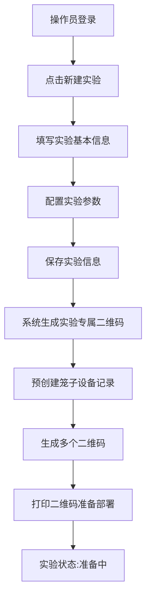
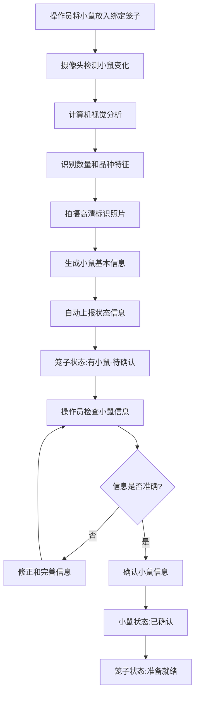
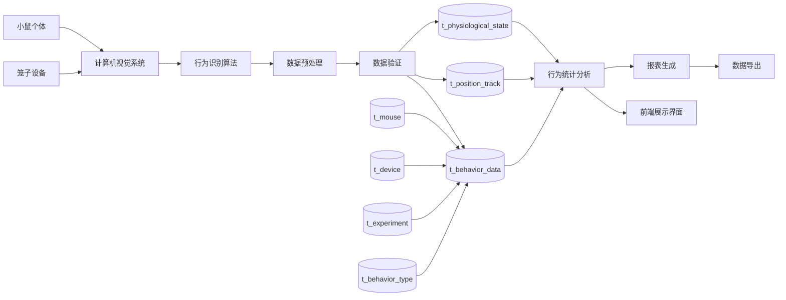
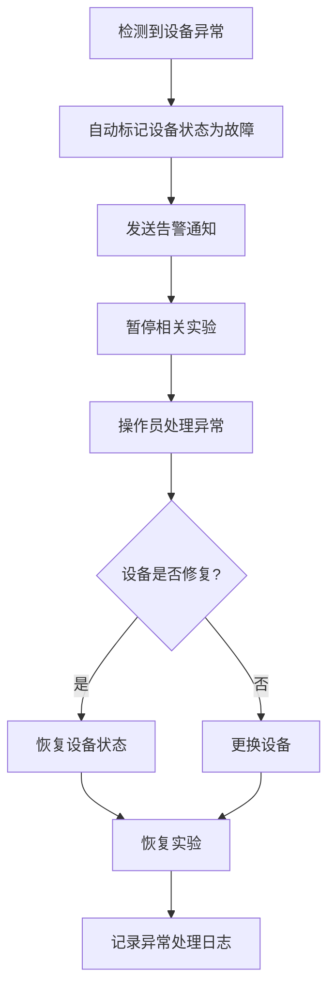
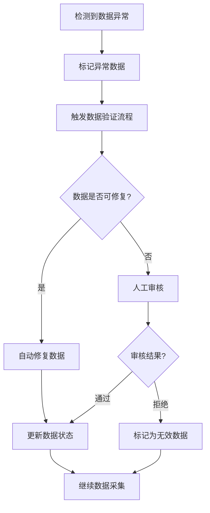

# 视觉小鼠管理系统业务流程指南

## 全流程概览

视觉小鼠管理系统是一个集成了物联网、计算机视觉、数据分析和实验管理的智能化平台。系统通过自动化技术实现从实验准备到数据分析的全流程管理，为科研人员提供高效、准确的小鼠行为研究工具。

### 核心流程架构

整个系统围绕**实验-笼子-小鼠-数据**四个核心要素构建，采用"实验驱动"的设计理念，通过以下六个主要阶段实现完整的实验管理：

1. **实验项目创建阶段**
   - 创建实验项目与参数配置
   - 生成实验专属二维码
   - 实验笼子预分配与绑定
   - 移动端扫码支持与笼子详情查看

2. **笼子部署与绑定阶段**
   - 实验二维码物理部署到笼子
   - 摄像头系统扫描识别实验二维码
   - 自动完成笼子与实验的绑定关系
   - 笼子状态激活与位置确认

3. **小鼠信息采集阶段**
   - 向绑定笼子中添加小鼠
   - 计算机视觉自动识别小鼠数量与品种
   - 系统自动上报小鼠状态信息
   - 人工确认与信息完善

4. **实验启动与监控阶段**
   - 确认所有笼子和小鼠准备就绪
   - 一键启动实验数据采集
   - 实时行为数据采集与处理
   - 多维度数据验证与质量监控

5. **实时分析与可视化阶段**
   - 行为统计图表实时展示
   - 小鼠活动轨迹可视化
   - 异常行为预警与通知
   - 实验进度跟踪与状态监控

6. **数据分析与报表生成阶段**
   - 多层次数据挖掘分析
   - 统计指标计算与置信区间
   - 自动化报表生成
   - 多格式导出与分享

### 技术特色与优势

- **全自动化流程**：从小鼠识别到数据分析，最大程度减少人工干预
- **实时数据处理**：毫秒级数据采集与处理，确保实验数据的时效性
- **智能质量控制**：多层次数据验证机制，保证数据准确性和可靠性
- **灵活配置管理**：支持多种实验参数配置，适应不同研究需求
- **可视化分析**：丰富的图表展示和交互式数据探索功能

### 用户角色与权限

系统支持两种主要用户角色：
- **操作员**：负责日常实验操作、数据监控和基础分析
- **审计员**：具备完整系统权限，负责实验审核、高级分析和系统管理

## 文档概述

本文档详细描述了计算机视觉小鼠管理系统的完整业务流程，涵盖操作员和审计员两种用户角色的操作流程。系统从添加笼子开始，逐步完成设备管理、小鼠管理、实验管理和行为数据监控的全流程操作。

## 用户角色定义

### 操作员 (Operator)
- **权限范围**: 日常操作权限，包括设备管理、小鼠管理、实验创建和数据录入
- **主要职责**: 系统日常运维、数据录入、设备监控、实验执行
- **操作限制**: 不能删除关键数据，不能修改系统配置

### 审计员 (Auditor)
- **权限范围**: 查看和审核权限，包括数据查询、报表生成、质量审核
- **主要职责**: 数据审核、质量控制、报表分析、合规检查
- **操作限制**: 只读权限，不能修改业务数据

## 核心业务流程

### 1. 实验项目创建流程

#### 1.1 创建实验项目与参数配置 (操作员)

**自然语言描述**:
1. 操作员登录系统，进入实验管理页面
2. 点击"新建实验"按钮，填写实验基本信息:
   - 实验编号 (experiment_code): 系统自动生成唯一标识，如 "EXP_2024_001"
   - 实验名称 (experiment_name): 实验项目名称
   - 实验类型 (experiment_type): 行为学/生理学/药理学等
   - 实验描述 (description): 详细实验说明
   - 负责人 (principal_investigator): 实验负责人
   - 预计笼子数量: 本实验需要的笼子数量
3. 配置实验参数:
   - 跟踪时间设置: 设定实验的开始和结束时间
   - 采集频率配置: 设置数据采集的时间间隔（如每秒、每分钟）
   - 监控侧重点: 选择重点关注的行为类型
   - 数据质量要求: 设置数据采集的精度和可信度阈值
   - 告警规则: 配置异常行为的告警条件
4. 保存实验信息到 t_experiment 表
5. 实验状态设置为"准备中"

#### 1.2 生成实验专属二维码与笼子预分配 (系统自动)

**自然语言描述**:
1. 系统根据实验信息和预计笼子数量自动生成实验专属二维码
2. 二维码包含以下信息:
   - 实验编号 (experiment_code)
   - 实验名称和类型
   - 笼子编号 (系统预分配，如 "EXP_2024_001_CAGE_001")
   - 实验参数配置信息
   - 移动端访问链接
3. 系统预创建笼子设备记录:
   - 设备编号 (device_code): 基于实验编号生成
   - 设备名称 (device_name): 如 "实验001-笼子1"
   - 关联实验 (experiment_id): 自动关联到创建的实验
   - 设备状态 (status): 初始状态为 "待部署"
4. 生成多个二维码（根据预计笼子数量）
5. 操作员可打印二维码准备物理部署
**流程图**:


### 2. 笼子部署与绑定流程

#### 2.1 实验二维码物理部署 (操作员)

**自然语言描述**:
1. 操作员获取打印好的实验专属二维码
2. 将二维码物理贴放到对应的笼子位置
3. 确保二维码清晰可见，便于摄像头扫描
4. 可选择性地在笼子上标注实验信息
5. 完成物理部署后，笼子状态保持"待部署"

#### 2.2 摄像头扫描识别与自动绑定 (系统自动)

**自然语言描述**:
1. 摄像头系统持续扫描识别笼子上的实验二维码
2. 系统解析二维码获取实验信息和笼子编号
3. 自动确定笼子的物理位置坐标
4. 建立笼子与实验的绑定关系:
   - 更新笼子位置信息到 t_device 表
   - 关联笼子到对应实验 (experiment_id)
   - 激活笼子的摄像头监控功能
5. 笼子状态更新为"已绑定"，等待小鼠添加
6. 系统记录绑定时间、位置信息和操作日志
7. 支持移动端扫码查看笼子详情和实验状态

#### 2.3 移动端扫码支持 (操作员/审计员)

**自然语言描述**:
1. 用户使用移动设备扫描笼子上的实验二维码
2. 系统识别用户身份和权限
3. 展示笼子详细信息:
   - 关联的实验项目信息
   - 笼子当前状态和位置
   - 小鼠数量和基本信息
   - 实时行为数据概览
   - 实验进度和时间安排
4. 支持基础操作:
   - 查看实时监控画面
   - 记录观察备注
   - 上报异常情况
   - 查看历史数据摘要
5. 权限控制:
   - 操作员: 可进行数据录入和状态更新
   - 审计员: 只读权限，查看和审核功能

### 3. 小鼠信息采集流程

#### 3.1 向绑定笼子添加小鼠 (操作员)

**自然语言描述**:
1. 操作员确认笼子已与实验成功绑定（状态为"已绑定"）
2. 根据实验设计要求，将指定数量和品种的小鼠放入笼子
3. 确保小鼠健康状态良好，符合实验要求
4. 记录放入时间和操作员信息
5. 触发系统自动识别流程

#### 3.2 系统自动识别与状态上报 (系统自动)

**自然语言描述**:
1. 摄像头系统自动检测笼子内的小鼠变化
2. 计算机视觉算法实时分析小鼠信息:
   - 自动统计小鼠数量
   - 识别小鼠品种特征（毛色、体型等）
   - 评估小鼠健康状态和活跃度
   - 检测异常行为或状态
3. 为每只小鼠拍摄高清标识照片
4. 系统自动生成小鼠基本信息:
   - 小鼠编号 (mouse_code): 基于实验和笼子编号生成，如 "EXP_2024_001_CAGE_001_M001"
   - 小鼠照片 (photo): 系统拍摄的标识照片
   - 检测时间 (detected_time): 首次检测到的时间
   - 所属笼子 (device_id): 自动关联笼子信息
   - 关联实验 (experiment_id): 自动关联实验信息
   - 品种信息 (breed): 系统识别的品种特征
   - 初始状态 (status): 设置为"待确认"
5. 系统将小鼠信息保存到 t_mouse 表
6. 自动上报小鼠状态信息到实验管理系统
7. 笼子状态更新为"有小鼠-待确认"

#### 3.3 人工确认与信息完善 (操作员)

**自然语言描述**:
1. 操作员进入实验管理页面，查看对应实验的小鼠确认列表
2. 逐一检查系统识别的小鼠信息:
   - 确认小鼠数量是否与实验设计一致
   - 验证小鼠品种识别的准确性
   - 检查小鼠照片质量和清晰度
   - 评估小鼠健康状态是否符合实验要求
3. 补充和完善小鼠详细信息:
   - 性别确认和标记
   - 年龄和体重信息
   - 特殊标记或编号
   - 健康状态详细记录
   - 实验分组信息
4. 对每只小鼠进行人工标记和验证
5. 确认所有信息无误后，操作员点击"确认小鼠信息"按钮
6. 系统更新所有小鼠状态为"已确认"
7. 笼子状态更新为"准备就绪"，等待实验启动
8. 记录确认时间和操作员信息

**流程图**:


### 4. 实验启动与监控流程

#### 4.1 实验就绪状态检查 (系统自动)

**自然语言描述**:
1. 系统持续监控实验的准备状态
2. 检查所有关联笼子的状态:
   - 笼子与实验绑定状态: "已绑定"
   - 小鼠确认状态: 所有小鼠为"已确认"
   - 设备工作状态: 摄像头和监控设备正常
   - 网络连接状态: 数据传输通道畅通
3. 实验参数配置完整性验证:
   - 跟踪时间设置合理
   - 采集频率配置有效
   - 监控侧重点明确
   - 数据质量要求可达
4. 当所有条件满足时，实验状态自动更新为"可启动"
5. 向操作员发送实验就绪通知

#### 4.2 一键启动实验 (操作员)

**自然语言描述**:
1. 操作员进入实验管理页面，查看"可启动"状态的实验
2. 点击"启动实验"按钮，系统进行最终确认:
   - 再次验证所有前置条件
   - 确认操作员权限和身份
   - 检查系统资源和存储空间
3. 系统初始化数据采集模块:
   - 激活所有关联笼子的摄像头监控
   - 启动行为识别算法
   - 初始化数据存储和处理流程
   - 配置实时数据推送机制
4. 实验状态更新为"进行中"
5. 开始正式的数据采集和行为监控
6. 记录实验启动时间、操作员信息和系统状态
7. 向相关人员发送实验启动通知

#### 4.3 实时数据采集与处理 (系统自动)

**自然语言描述**:
1. 摄像头系统持续监控所有参与实验的笼子
2. 计算机视觉算法实时识别小鼠行为:
   - 基础行为: 静止、行走、跑步、跳跃、进食、饮水等
   - 社交行为: 互动、追逐、打斗、群聚等
   - 异常行为: 刻板行为、异常姿态、健康异常等
3. 多维度数据验证与质量监控:
   - 数据完整性检查
   - 置信度评估和过滤
   - 异常数据标记和处理
   - 数据采集频率监控
4. 实时数据处理和存储:
   - 行为数据分类和标记
   - 位置轨迹记录和分析
   - 统计指标实时计算
   - 数据质量评估和报告

### 4. 行为数据监控流程

#### 4.1 实时数据采集与推送 (系统自动)

**自然语言描述**:
1. 摄像头系统持续监控笼子内的小鼠行为
2. 计算机视觉算法实时识别小鼠行为类型:
   - 基础行为: 静止、行走、跑步、跳跃等
   - 社交行为: 互动、追逐、打斗等
   - 异常行为: 刻板行为、异常姿态等
3. 系统将识别结果封装成JSON报文格式
4. 通过网络接口向服务器终端实时推送数据:
   ```json
   {
     "timestamp": "2024-01-15T10:30:45.123Z",
     "cage_id": "CAGE_001",
     "mouse_id": "CAGE_001_M001",
     "behavior_type": "running",
     "confidence": 0.95,
     "position": {"x": 120, "y": 80},
     "duration": 2.5
   }
   ```
5. 数据推送频率根据实验配置的采集频率执行

#### 4.2 服务器数据接收与处理 (系统自动)

**自然语言描述**:
1. 服务器终端接收来自摄像头系统的JSON报文
2. 数据验证和预处理:
   - 验证报文格式和数据完整性
   - 检查数据的时间戳和序列性
   - 过滤异常和重复数据
3. 数据分类和聚拢处理:
   - 按小鼠编号分类存储行为数据
   - 按时间窗口聚合统计信息
   - 计算行为持续时间和频次
   - 生成实时统计指标
4. 数据存储到相应数据表:
   - 原始行为数据保存到 t_behavior_data 表
   - 位置轨迹数据保存到 t_position_track 表
   - 聚合统计数据保存到汇总表
5. 触发实时数据更新事件，通知前端页面刷新

#### 4.3 实时数据展示 (操作员/审计员)

**自然语言描述**:
1. 用户进入行为监控页面，查看实时数据展示
2. 页面实时更新显示内容:
   - 实时行为统计图表: 各种行为类型的实时计数
   - 小鼠活动轨迹图: 显示小鼠在笼子中的移动路径
   - 行为时间线: 按时间顺序显示行为变化
   - 异常行为告警: 突出显示异常或关注的行为
3. 多维度数据筛选和查看:
   - 按实验、笼子、小鼠筛选数据
   - 按时间范围查看历史数据
   - 按行为类型过滤显示
4. 数据质量监控:
   - 显示数据采集状态和质量指标
   - 展示数据可信度和置信区间
   - 标记数据异常和缺失情况

### 5. 数据分析与报表生成流程

#### 5.1 数据处理与挖掘 (系统自动)

**自然语言描述**:
1. 系统基于小鼠信息确定数据分析范围:
   - 根据小鼠品种、性别、年龄等属性分组分析
   - 按实验类型和时间段划分数据集
   - 识别数据的完整性和可信度
2. 执行多层次数据挖掘分析:
   - 行为模式识别: 发现小鼠的行为规律和周期性
   - 异常行为检测: 识别偏离正常模式的行为
   - 相关性分析: 分析不同行为之间的关联关系
   - 趋势分析: 识别行为随时间的变化趋势
3. 计算统计指标和置信区间:
   - 各行为类型的频次统计和分布
   - 行为持续时间的均值、方差和置信区间
   - 小鼠活动强度和活跃度指标
   - 数据质量评估和可信度评分
4. 生成数据分析结果和洞察报告

#### 5.2 报表生成与文档整理 (操作员/审计员)

**自然语言描述**:
1. 用户进入报表管理页面，选择报表生成参数:
   - 选择分析的实验、时间范围和小鼠群体
   - 设定报表类型: 综合报告、行为分析报告、异常报告等
   - 配置统计指标和图表类型
2. 系统自动生成多格式报表文档:
   - **数据表格**: 包含详细的统计数据和计算结果
   - **可视化图表**: 行为分布图、趋势图、热力图等
   - **置信区间文档**: 统计学分析结果和可信度评估
   - **分析洞察**: 基于数据挖掘的发现和建议
3. 报表内容包括:
   - 实验基本信息和参与小鼠概况
   - 各行为类型的统计分析结果
   - 异常行为检测和告警记录
   - 数据质量评估和置信区间
   - 结论和建议
4. 支持多种格式导出:
   - PDF格式: 完整的分析报告文档
   - Excel格式: 详细数据表格和统计结果
   - CSV格式: 原始数据和处理后数据
   - 图片格式: 各类统计图表和可视化结果

#### 5.3 报表下载与分享 (操作员/审计员)

**自然语言描述**:
1. 用户在报表列表中查看已生成的报表
2. 可预览报表内容和质量
3. 选择需要的报表格式进行下载
4. 支持报表分享和权限控制:
   - 生成报表分享链接
   - 设置访问权限和有效期
   - 记录下载和访问日志
5. 报表归档和版本管理:
   - 自动保存报表历史版本
   - 支持报表对比和差异分析
   - 长期存储和备份管理

## 完整业务流程图

```mermaid
flowchart TD
    %% 用户登录
    A[用户登录系统] --> B{用户角色?}
    B -->|操作员| C[操作员工作台]
    B -->|审计员| D[审计员工作台]
    
    %% 操作员流程 - 实验驱动架构
    C --> E[创建实验项目]
    E --> E1[配置实验参数]
    E1 --> E2[生成实验专属二维码]
    E2 --> E3[预分配笼子设备]
    E3 --> E4[打印二维码准备部署]
    
    %% 笼子部署与绑定
    E4 --> F[物理部署二维码到笼子]
    F --> F1[摄像头扫描实验二维码]
    F1 --> F2[自动绑定笼子与实验]
    F2 --> F3[笼子状态:已绑定]
    F3 --> F4[支持移动端扫码查看]
    
    %% 小鼠信息采集
    F4 --> G[向绑定笼子添加小鼠]
    G --> G1[系统自动识别小鼠]
    G1 --> G2[识别数量品种特征]
    G2 --> G3[自动上报状态信息]
    G3 --> G4[人工确认完善信息]
    G4 --> G5[笼子状态:准备就绪]
    
    %% 实验启动与监控
    G5 --> H[系统检查实验就绪状态]
    H --> H1[一键启动实验]
    H1 --> H2[实时数据采集处理]
    H2 --> H3[多维度数据验证]
    H3 --> H4[实时数据展示]
    
    %% 数据分析
    H4 --> I[数据挖掘分析]
    I --> I1[计算置信区间]
    I1 --> I2[生成分析报告]
    I2 --> I3[多格式报表]
    
    %% 审计员流程
    D --> K[数据查看权限]
    K --> K1[实时监控页面]
    K1 --> K2[历史数据分析]
    K2 --> K3[报表审核]
    
    %% 共同流程 - 报表下载
    I3 --> L[报表预览]
    K3 --> L
    L --> M[选择下载格式]
    M --> N[PDF/Excel/CSV下载]
    N --> O[报表分享]
    O --> P[流程结束]
    
    %% 样式定义
    classDef operatorClass fill:#e1f5fe
    classDef auditorClass fill:#f3e5f5
    classDef systemClass fill:#e8f5e8
    classDef dataClass fill:#fff3e0
    classDef reportClass fill:#f1f8e9
    classDef experimentClass fill:#e8eaf6
    
    class C,E,E1,E4,F,G,G4,H1 operatorClass
    class D,K,K1,K2,K3 auditorClass
    class E2,E3,F1,F2,F3,G1,G2,G3,H,H2,H3 systemClass
    class H4,I,I1,I2 dataClass
    class I3,L,M,N,O reportClass
    class E,E1,G5,H1 experimentClass
```



## 数据流向图



## 关键业务规则

### 1. 数据完整性规则
- 小鼠必须分配到笼子后才能开始实验
- 实验必须关联至少一只小鼠才能启动
- 行为数据必须关联有效的小鼠和设备
- 删除操作需要检查数据关联关系

### 2. 权限控制规则
- 操作员: 具有增删改查权限，但不能删除正在进行的实验数据
- 审计员: 只有查看和导出权限，不能修改任何业务数据
- 系统管理员: 具有所有权限，包括用户管理和系统配置

### 3. 数据质量规则
- 设备编号和小鼠编号必须唯一
- 行为数据采集频率不低于每秒1次
- 异常数据自动标记并提醒人工审核
- 数据备份每日自动执行

### 4. 业务流程规则
- 设备添加 → 小鼠管理 → 实验创建 → 数据采集的顺序不可颠倒
- 实验进行中不允许修改关键参数
- 数据采集异常时自动暂停实验并发送告警
- 实验结束后数据自动归档

## 异常处理流程

### 1. 设备异常处理


### 2. 数据异常处理


## 系统集成接口

### 1. 外部系统接口
- **计算机视觉模块**: 提供行为识别和位置追踪数据
- **环境监控系统**: 提供温湿度、光照等环境数据
- **实验室管理系统**: 同步实验计划和人员信息

### 2. 数据同步机制
- 实时数据同步: 行为数据和位置数据
- 定时数据同步: 实验状态和设备状态
- 批量数据同步: 历史数据和报表数据

## 性能指标要求

### 1. 响应时间要求
- 页面加载时间: < 3秒
- 数据查询响应: < 2秒
- 实时数据更新: < 1秒
- 报表生成时间: < 30秒

### 2. 数据处理能力
- 支持同时监控: 100个笼子
- 数据采集频率: 每秒1000条记录
- 数据存储容量: 支持1年以上历史数据
- 并发用户数: 50个用户同时在线

## 总结

本业务流程指南详细描述了计算机视觉小鼠管理系统的完整自动化操作流程，采用创新的"实验驱动"设计理念，核心特点如下：

### 核心流程特色
1. **实验驱动架构**: 以实验项目为起点，通过实验专属二维码实现笼子与实验的直接绑定，简化了传统的笼子注册流程
2. **智能绑定机制**: 摄像头系统自动识别实验二维码，实现笼子与实验的无缝绑定，支持移动端扫码查看笼子详情
3. **自动化小鼠识别**: 系统自动检测小鼠数量、品种特征和健康状态，并自动上报到实验管理系统
4. **一键启动实验**: 系统自动检查实验就绪状态，支持一键启动多笼子实验，简化操作流程
5. **实时数据处理**: 多维度数据验证与质量监控，确保数据采集的准确性和可靠性
6. **移动端支持**: 通过扫描笼子上的实验二维码，可在移动端查看实时监控、记录观察备注和上报异常情况

### 技术优势
- **流程简化**: 将传统的"笼子→小鼠→实验"流程优化为"实验→笼子→小鼠"，减少操作步骤
- **自动绑定**: 通过实验二维码实现笼子与实验的自动绑定，避免手动选择和关联的错误
- **状态智能**: 系统自动监控实验准备状态，只有在所有条件满足时才允许启动实验
- **移动便利**: 支持移动端扫码查看和操作，提高现场工作的便利性
- **数据可信**: 通过多层次验证和置信区间计算确保数据质量和分析结果的可靠性

### 流程优化亮点
- **前置实验创建**: 将实验创建提前到流程最前端，使整个流程围绕实验目标展开
- **二维码创新应用**: 实验专属二维码不仅用于笼子绑定，还支持移动端访问和信息查看
- **状态自动上报**: 小鼠信息自动上报到实验系统，减少数据录入工作量
- **就绪状态检查**: 系统自动检查实验启动条件，确保实验的顺利进行

### 用户价值
- **操作员**: 流程更加直观简洁，减少操作步骤和人为错误，提高工作效率
- **审计员**: 获得更加完整和准确的实验数据，支持高质量的审核和分析工作
- **研究人员**: 实验设计更加灵活，数据采集更加可靠，分析结果更加可信
- **现场工作人员**: 通过移动端扫码可随时查看笼子状态和实验进度，提高现场管理效率

通过"实验驱动"的创新设计理念，本系统不仅简化了操作流程，还提高了数据质量和用户体验。明确的角色权限划分、智能的状态管理和完整的移动端支持，为实验室的小鼠行为研究提供了一个更加高效、可靠、便捷的技术支撑平台。